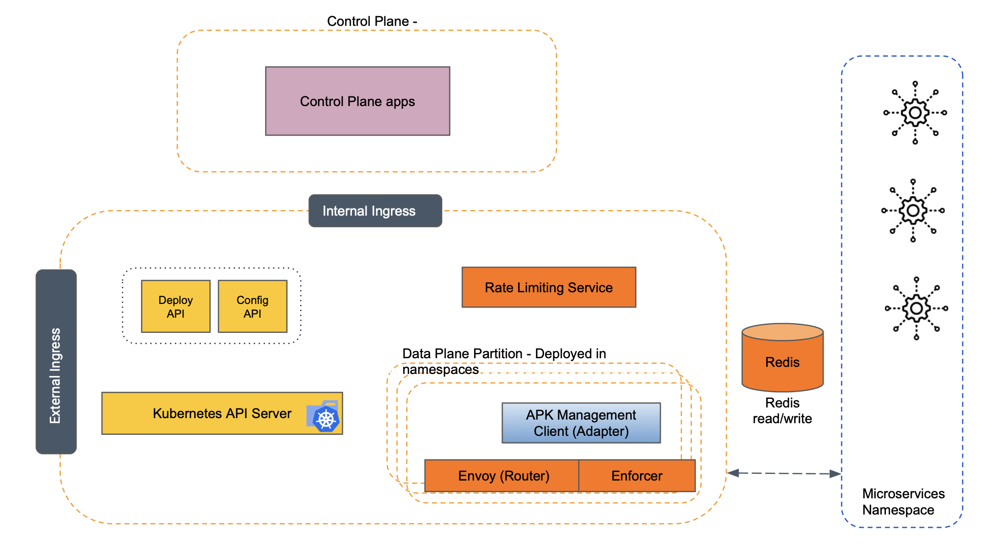
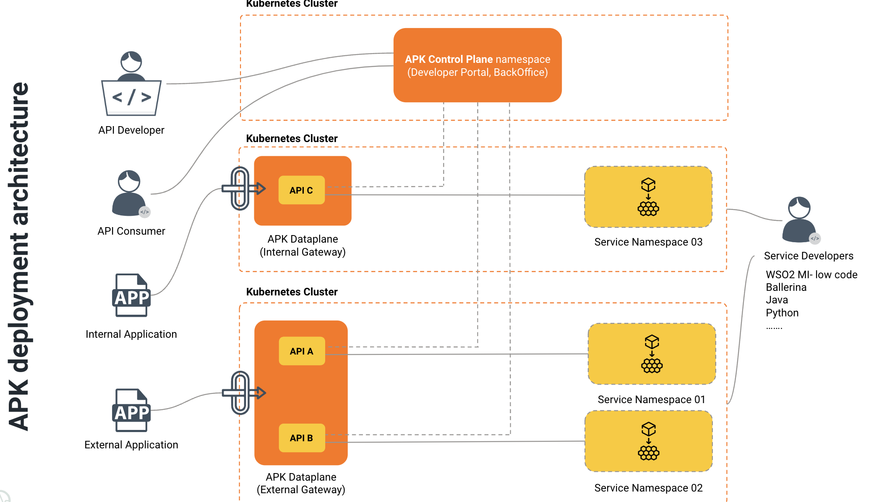

# Architecture

APK is an open-source platform for providing complete API Management capabilities on top of the Kubernetes cluster management platform.

**Overview architecture of the WSO2 APK platform:**

**APK is composed of these components:**

To support cloud native Kubernetes environments, the platform’s deployment consists of data plane components.

**The Data Plane** is responsible for handling the runtime design, processing API requests, and applying API management quality of services.It’s designed to handle high volume, real-time data processing and includes functions for routing, rate limiting, and security. The APK runtime consists of three main sub-components: 
- The Runtime Manager is responsible for configuring the runtime aspects of APIs, discovering Kubernetes services, and converting them into APIs.
- The Management Client communicates with the management server (control plane) to push and pull updates and maintain connectivity between the data plane and the control plane.
- The API Gateway has two main components. The Router intercepts incoming API traffic and applies quality of service such as authentication, authorization, and rate limiting. Meanwhile, the Enforcer enforces API management capabilities, such as security, rate limiting, analytics, validation, etc.
- Redis and Envoy Rate Limiter components are deployed to manage and throttle traffic within the dataplane. These components effectively address the requirements for traffic management and enable fine-grained control of API traffic. By using these components, organizations can ensure that their APIs are protected from overuse, while also providing an optimized user experience.

The dataplane components are primarily used by individuals who invoke APIs and make use of their functionality.
When a user invokes an API, it first enters the router component, which serves as the main entry point. The router identifies resources and matched APIs and then connects with the enforcer to authenticate the API request. Rate limit policies and other API-level policies are then applied to the request.
Once the gateway processing is complete, the request is passed to the backend service, and similarly, API policies can be executed in the response path as well. Since the dataplane is responsible for handling the majority of the load when users consume APIs, it is essential to plan carefully to ensure proper scaling of the deployment with load.

# Deployment Architecture
- The APK product offers a highly flexible deployment architecture that is suitable for modern cloud native deployments. 
- There are various deployment options available to users, including a multi-cluster deployment model, where each region has its own cluster running the APK dataplane, and these dataplanes are connected to a central control plane through a global network.
- This ensures high availability and disaster recovery scenarios, preventing an outage in one region from impacting the availability of the entire system.

- To support these deployment models, APK utilizes Kubernetes features such as node selectors, affinity, and anti-affinity rules, to schedule pods in the appropriate region. 
- This approach provides organizations with the flexibility to deploy the APK platform across different data centers, clusters within the same data center, or different mega clouds, based on their requirements.

Moreover, APK also provides a flexible solution for different departments or lines of business within an organization to have their own deployments. This can be achieved by using Kubernetes cluster or namespaces to create isolated environments for each department or line of business, with their API gateway instances and custom configurations. Each department can have its own set of resources, such as pods, services, and ingress controllers, that are managed independently of other clusters or namespaces. This approach allows for better control over resource allocation and access control, enabling each department or line of business to deploy and manage their APIs as per their preferences.

The technical diagram below illustrates the deployment of the control plane, data plane components, and microservices that are exposed as managed APIs. It showcases the implementation of a unified control plane that manages both external and internal data planes, which are deployed on separate Kubernetes clusters to ensure better isolation. These data planes are connected to microservices deployments that are housed in distinct namespaces within the data plane clusters.

Alternatively, all components can be deployed within a single Kubernetes cluster, providing organizations with greater flexibility in terms of deployment options. With this approach, the control plane, data plane, and microservices can be managed and monitored from a single location, simplifying management and improving resource utilization.

# Technologies Used 
A multi-language approach is adopted for implementation in WSO2 APK, with management domain services being written in Ballerina and Java. The API gateway is built using Envoy as the foundation and certain gateway extensions are developed using Go and C++.

In the initial product analysis, it was found that the Kubernetes gateway API could effectively define APIs and gateways. The Envoy API gateway project was chosen as the API gateway implementation due to its streamlined deployment model and API layer, specifically suited for API gateway use cases. The Kubernetes gateway API is utilized for configuring the gateway. The use of Envoy as the foundation for the API gateway provides high performance, light weight, and rich features, including centralized API traffic management, authentication, rate limiting, and request/response transformation.

Custom resource definitions (CRDs) are utilized internally to define the APIs (known as ingress resources), policies, and other required information for API deployment, providing greater flexibility and control over artifact management and deployment within the platform. For a more comprehensive understanding of the technologies and frameworks used in WSO2 APK, users are invited to visit the project's GitHub repository.
