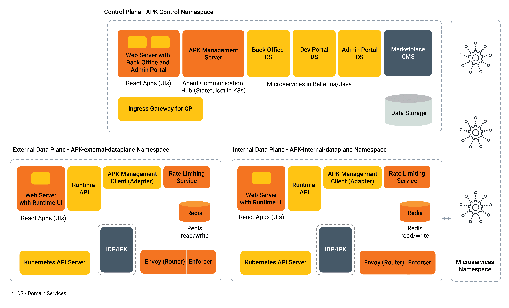

# Architecture

APK is an open-source platform for providing complete API Management capabilities on top of the Kubernetes cluster management platform.

APK is composed of these components:

To support cloud native Kubernetes environments, the platform’s deployment consists of two main components.

**The Control Plane** is responsible for managing the overall functioning of WSO2’s APK system.  It includes API management back-office capabilities, admin tasks, and API marketplace functionality. It consists of four main sub-components: 
- The Back Office is responsible for configuring the portal aspects of APIs, including description, document, image, etc.
- The Dev Portal allows API consumers to discover and consume APIs.
- The Admin Portal is used to configure rate limit policies, key management services, and other administrative tasks.
- The Management Server communicates with data planes and pushes updates whenever required.

The APK control plane serves different user personas, such as API product managers, organization or system administrators, and API consumers. Each persona interacts with the control plane components differently.
API product managers oversee API lifecycles, including attaching documents, thumbnails, and descriptions to APIs, managing portal aspects and visibility, and attach different business plans to APIs..
API consumers use the APK control plane to search and discover APIs, try them out, read documents, subscribe to APIs, consume APIs, generate SDKs, and provide feedback to improve API performance.
Admin users,, manage organizations and business plans, define user and permission mappings, govern key management aspects, and oversee the management and governance of the organization or entire deployment.

**The Data Plane** is responsible for handling the runtime design, processing API requests, and applying API management quality of services. It’s designed to handle high volume, real-time data processing and includes functions for routing, rate limiting, and security. The APK runtime consists of three main sub-components: 
- The Runtime Manager is responsible for configuring the runtime aspects of APIs, discovering Kubernetes services, and converting them into APIs.
- The Management Client communicates with the management server (control plane) to push and pull updates and maintain connectivity between the data plane and the control plane.
- The API Gateway has two main components. The Router intercepts incoming API traffic and applies quality of service such as authentication, authorization, and rate limiting. Meanwhile, the Enforcer enforces API management capabilities, such as security, rate limiting, analytics, validation, etc.
- Redis and Envoy Rate Limiter components are deployed to manage and throttle traffic within the dataplane. These components effectively address the requirements for traffic management and enable fine-grained control of API traffic. By using these components, organizations can ensure that their APIs are protected from overuse, while also providing an optimized user experience.

The dataplane components are primarily used by individuals who invoke APIs and make use of their functionality. When a user invokes an API, it first enters the router component, which serves as the main entry point. The router identifies resources and matched APIs and then connects with the enforcer to authenticate the API request. Rate limit policies and other API-level policies are then applied to the request.
Once the gateway processing is complete, the request is passed to the backend service, and similarly, API policies can be executed in the response path as well. Since the dataplane is responsible for handling the majority of the load when users consume APIs, it is essential to plan carefully to ensure proper scaling of the deployment with load.

# Technologies Used 
A multi-language approach is adopted for implementation in WSO2 APK, with management domain services being written in Ballerina and Java. The API gateway is built using Envoy as the foundation and certain gateway extensions are developed using Go and C++. The front-end applications are envisioned to be built with the ReactJS framework.

In the initial product analysis, it was found that the Kubernetes gateway API could effectively define APIs and gateways. The Envoy API gateway project was chosen as the API gateway implementation due to its streamlined deployment model and API layer, specifically suited for API gateway use cases. The Kubernetes gateway API is utilized for configuring the gateway. The use of Envoy as the foundation for the API gateway provides high performance, light weight, and rich features, including centralized API traffic management, authentication, rate limiting, and request/response transformation.

Custom resource definitions (CRDs) are utilized internally to define the APIs (known as ingress resources), policies, and other required information for API deployment, providing greater flexibility and control over artifact management and deployment within the platform. For a more comprehensive understanding of the technologies and frameworks used in WSO2 APK, users are invited to visit the project's GitHub repository.
