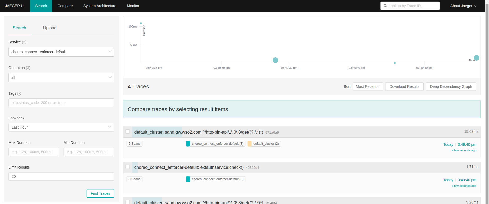
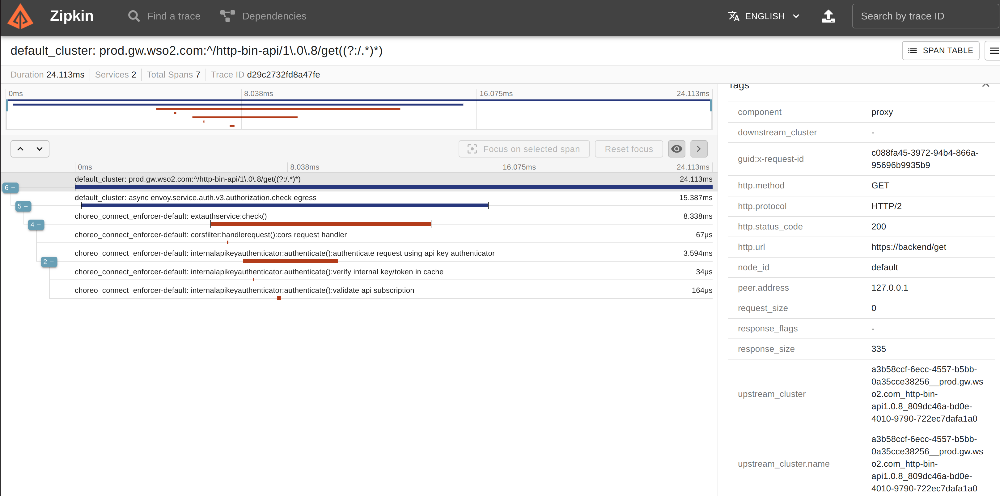
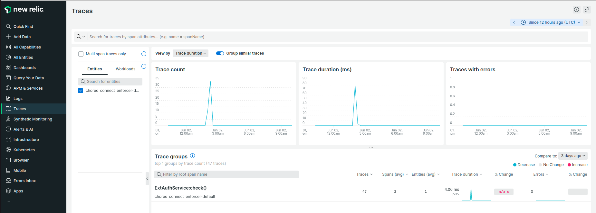

# Distributed Tracing

Performance issues, errors, and exceptions are unfortunate events that may occur in a production environment. In order to identify such an event, observing the production environment is essential. APK provides the ability to observe how the requests are handled via an OpenTelemetry based distributed tracing implementation. By connecting APK to one of the supported distributed tracing systems, users are able to easily debug and identify production issues.

Supported distributed tracing systems,

- Jaeger
- Zipkin
- Azure Application Insights
- OTLP gRPC supported telemetry backends

## Configure Distributed Tracing

!!! note
    If you are trying out tracing capabilities of APK and do not have an actual deployment of Jaeger or Zipkin, you can start APK together with Jaeger/Zipkin by applying  the below kubernetes artifacts to your cluster.
    === "Jaeger"

        ```yaml
        apiVersion: apps/v1
        kind: Deployment
        metadata:
          name: jaeger
        spec:
          selector:
            matchLabels:
              app: jaeger
          replicas: 1
          template:
            metadata:
              labels:
                app: jaeger
            spec:
              containers:
                - name: jaeger
                  image: jaegertracing/all-in-one:latest
                  imagePullPolicy: IfNotPresent
                  ports:
                    - containerPort: 16686
                    - containerPort: 9411
                    - containerPort: 4317
                  env:
                    - name: COLLECTOR_ZIPKIN_HOST_PORT
                      value: "9411"
                    - name: COLLECTOR_OTLP_ENABLED
                      value: "true"
                  resources:
                    limits:
                      cpu: "0.5"
                      memory: "512Mi"
                    requests:
                      cpu: "0.2"
                      memory: "256Mi"
        ---
        apiVersion: v1
        kind: Service
        metadata:
          name: jaeger
        spec:
          ports:
            - name: http
              protocol: TCP
              port: 16686
              targetPort: 16686
            - name: collector
              protocol: TCP
              port: 9411
              targetPort: 9411
            - name: otlp
              protocol: TCP
              port: 4317
              targetPort: 4317
          selector:
            app: jaeger
        ---
        apiVersion: networking.k8s.io/v1
        kind: Ingress
        metadata:
          name: jaeger
        spec:
          rules:
            - host: jaeger.example.com  
              http:
                paths:
                  - path: /api/v2/spans 
                    pathType: Prefix
                    backend:
                      service:
                        name: jaeger
                        port:
                          name: collector
                  - path: /
                    pathType: Prefix
                    backend:
                      service:
                        name: jaeger
                        port:
                          name: http
              
        ```

    === "Zipkin"

        ```yaml 
        apiVersion: apps/v1
        kind: Deployment
        metadata:
          name: zipkin
        spec:
          replicas: 1
          selector:
            matchLabels:
              app: zipkin
          template:
            metadata:
              labels:
                app: zipkin
            spec:
              containers:
                - name: zipkin
                  image: openzipkin/zipkin
                  imagePullPolicy: IfNotPresent
                  ports:
                    - containerPort: 9411
                  resources:
                    limits:
                      cpu: "0.5"
                      memory: "512Mi"
                    requests:
                      cpu: "0.2"
                      memory: "256Mi"
        ---
        apiVersion: networking.k8s.io/v1
        kind: Ingress
        metadata:
          name: zipkin-ingress
        spec:
          rules:
            - host: zipkin.example.com
              http:
                paths:
                  - path: /
                    pathType: Prefix
                    backend:
                      service:
                        name: zipkin
                        port:
                          number: 9411
        ---
        apiVersion: v1
        kind: Service
        metadata:
          name: zipkin
        spec:
          selector:
            app: zipkin
          ports:
            - protocol: TCP
              port: 9411
              targetPort: 9411  
        ```

### Jaeger

When using **Jaeger** for tracing, the format is same as for **Zipkin** to publish spans from APK. Therefore, the tracer type is configured as `zipkin`. Follow these steps to configure APK with Jaeger.

1. Update the `<APK_HOME>/helm-charts/values.yaml`'s `wso2.apk.dp.gatewayRuntime.tracing` section with the following values

    ```yaml
    tracing: 
      enabled: true
      type: "zipkin"
      configProperties: 
        host: "jaeger"
        port: "9411"
        endpoint: "/api/v2/spans"
        instrumentationName: "CHOREO-CONNECT"
        maximumTracesPerSecond: "2"
        maxPathLength: "256"
    ``` 

2. Follow the [quick start]({{base_path}}/en/latest/get-started/quick-start-guide/) guide and invoke backend.
3. Open Jaeger UI to view the traces. Navigate to http://CLUSTER_IP:16686

You will be able to browse through the request traces and expand each trace to view complete trace details.

[](../assets/img/distributed-tracing/trace-jaeger.png)

### Zipkin

Follow these steps to configure WSO2 APK with Zipkin.

1. Update the `<APK_HOME>/helm-charts/values.yaml`'s `wso2.apk.dp.gatewayRuntime.tracing` section with the following values

    ```yaml
    tracing: 
      enabled: true
      type: "zipkin"
      configProperties: 
        host: "jaeger"
        port: "9411"
        endpoint: "/api/v2/spans"
        instrumentationName: "CHOREO-CONNECT"
        maximumTracesPerSecond: "2"
        maxPathLength: "256"
    ``` 
    
2. Follow the [quick start]({{base_path}}/en/latest/get-started/quick-start-guide/) guide and invoke backend.
3. Invoke the newly create API and open Zipkin UI to view the traces. Navigate to <http://CLUSTER_IP:9411> 
4. Filter traces by `tagQuery=otel.library.name=CHOREO-CONNECT` query.

You will be able to see all traces. Detailed trace view will look like below.

[](../assets/img/distributed-tracing/trace-zipkin.png)

### Azure Application Insights

Follow these steps to configure WSO2 APK with Azure Application Insights.

1. First you need to obtain the `ConnectionString` from the Azure portal.
    * Log in to the Azure portal.
    * Copy the `Connection String` from the overview page of `Application Insights` resource. E.g., 
    ```
    InstrumentationKey=ab71943f-xxxx-xxxx-xxxx-fb2eb69ae11d;IngestionEndpoint=https://region.applicationinsights.azure.com/
    ```

2. Add the following configuration to `<APK_HOME>/helm-charts/values.yaml`'s `wso2.apk.dp.gatewayRuntime.tracing` section.

    === "Configuration"

        ```yaml 
        tracing: 
          enabled: true
          type: "azure"
          configProperties: 
            connectionString: {APPLICATIONINSIGHTS_CONNECTION_STRING}
            instrumentationName: "CHOREO-CONNECT"
            maximumTracesPerSecond: "2"
        ``` 

    === "Example"
      
        ```yaml 
        tracing: 
          enabled: true
          type: "azure"
          configProperties: 
            connectionString: "InstrumentationKey=ab71943f-xxxx-xxxx-xxxx-fb2eb69ae11d;IngestionEndpoint=https://xxxxxx.applicationinsights.azure.com/"
            instrumentationName: "CHOREO-CONNECT"
            maximumTracesPerSecond: "2"
        ``` 

3. Follow the [quick start]({{base_path}}/en/latest/get-started/quick-start-guide/) guide and invoke backend.
4. Now open "Azure Application Insights" Trasaction search window and select `Dependency` for `Event types` filter  
    

You will be able to see all traces. Detailed trace view will look like below.


### OpenTelemetry protocol (OTLP)

 OTLP is a vendor agnostic protocol defined as a part of [OpenTelemetry](https://opentelemetry.io/) project to publish telemetry data to any telemetry backend that supports OTLP. Most of the open source and commercial telemetry backends have native OTLP support or provide OTLP support in the form of a separate distribution. Refer the [OpenTelemetry vendor support](https://opentelemetry.io/vendors/) documentation for more information.

#### Configure APK to publish OTLP traces to a Jaeger backend

1. The kubernetes artifacts you have applied at the beginning already contain the required configuration for APK to publish OTLP traces. Add the following configuration to `<APK_HOME>/helm-charts/values.yaml`'s `wso2.apk.dp.gatewayRuntime.tracing` section.

    ```yaml
    tracing: 
      enabled: true
      type: "otlp"
      configProperties: 
        host: "jaeger"
        port: "4317"
        endpoint: "/api/v2/spans"
        instrumentationName: "CHOREO-CONNECT"
        maximumTracesPerSecond: "2"
        maxPathLength: "256"
        connectionTimeout: "20"
    ``` 

2. Follow the [quick start]({{base_path}}/en/latest/get-started/quick-start-guide/) guide and invoke backend.
3. Open Jaeger UI to view the traces. Navigate to <http://CLUSTER_IP:16686> 

You will be able to browse through the request traces and expand each trace to view complete trace details.

#### Configure APK to publish OTLP traces to New Relic OTLP gRPC collector

1. Create an account in New Relic portal and generate a license key to publish traces. [New Relic OTLP guide](https://docs.newrelic.com/docs/more-integrations/open-source-telemetry-integrations/opentelemetry/opentelemetry-setup/)
2. Add the following configuration to`<APK_HOME>/helm-charts/values.yaml`'s `wso2.apk.dp.gatewayRuntime.tracing` section

=== "Configuration"

    ```yaml 
    tracing: 
      enabled: true
      type: "otlp"
      configProperties: 
        connectionString: "https://otlp.nr-data.net"
        authHeaderName: "api-key"
        authHeaderValue: "<INGEST_LICENSE_KEY>"
        instrumentationName: "CHOREO-CONNECT"
        maximumTracesPerSecond: "2"
        maxPathLength: "256"
        connectionTimeout: "20"
    ``` 
=== "Example"

    ```yaml 
    tracing: 
      enabled: true
      type: "otlp"
      configProperties: 
        connectionString: "https://otlp.nr-data.net"
        authHeaderName: "api-key"
        authHeaderValue: "e8f478ae6d3c97f845e16b6cfba0ea5e95e3NRAL"
        instrumentationName: "CHOREO-CONNECT"
        maximumTracesPerSecond: "2"
        maxPathLength: "256"
        connectionTimeout: "20"
    ``` 

3. Follow the [quick start]({{base_path}}/en/latest/get-started/quick-start-guide/) guide and invoke backend.
4. Go to New Relic Tracing dashboard to view the traces.

You will be able to browse through the request traces and expand each trace to view complete trace details.

[](../assets/img/distributed-tracing/trace-newrelic.png)

!!! info
    Similarly any telemetry backend that supports OTLP gRPC telemetry data collection can be used by setting up related values for `connectionString`, `authHeaderName` and `authHeaderValue`.