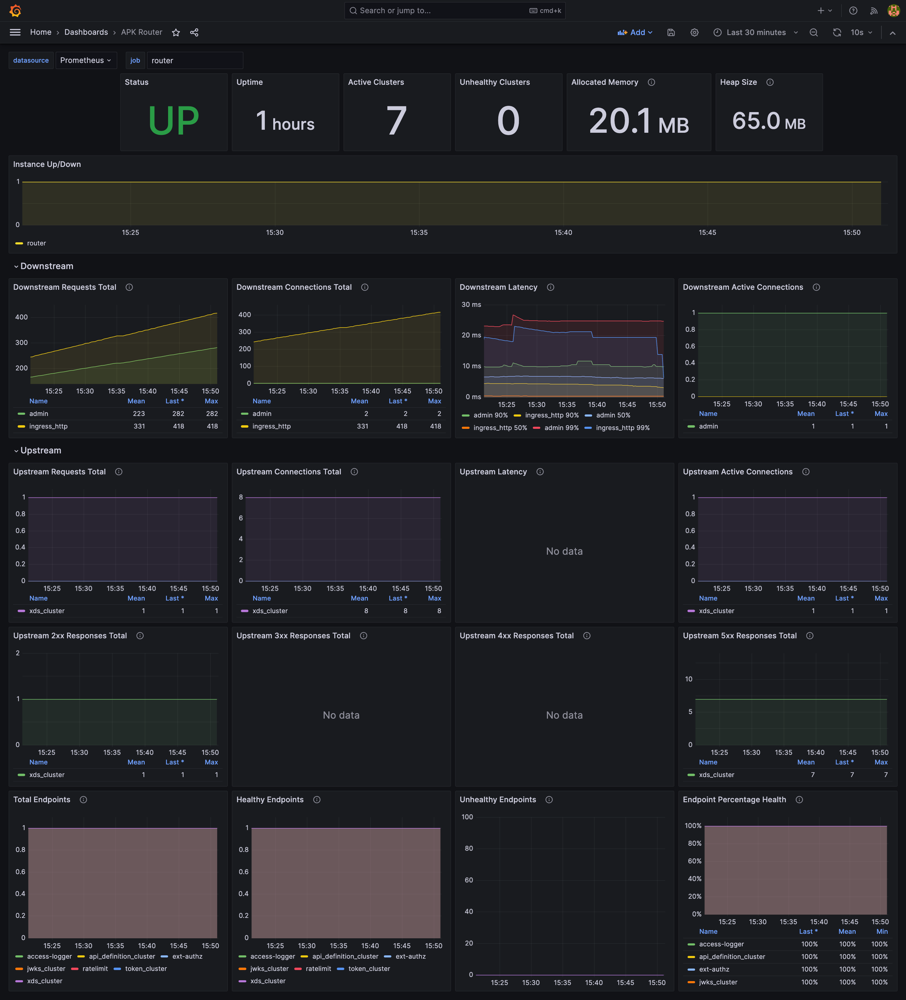

# Prometheus Metrics Support

The WSO2 API Platform for Kubernetes, integrated with Prometheus, enhances Kubernetes monitoring by providing monitoring and management capabilities for all APK components, leveraging real-time performance metrics. This enhanced observability empowers users to identify and address issues for smoother operations.

## Configure Prometheus Metrics

To enable metrics, simply make the metrics.enabled field true under the helm-charts/values.yaml file as shown.

```
metrics:
  enabled: true
```

All configurations related to metrics are as follows. The use of each configuration is described in the table below.
```
metrics:
  enabled: true   
  configDSBalHost: 0.0.0.0
  idpDSBalHost: 0.0.0.0
  statsd:
    image:
      repository: prom/statsd-exporter
       tag: v0.26.0
    imagePullPolicy: IfNotPresent
    resources:
       limits:
          memory: 128Mi
        requests:
          cpu: 0.1
           memory: 64Mi
```

| Prometheus Configuration         | Description                                                                                                                                                                                     |
| -------------------------------- | ----------------------------------------------------------------------------------------------------------------------------------------------------------------------------------------------- |
| enabled                          | Enables Prometheus metrics in the APK.                                                                                                                                                          |
| configDSBalHost                  | IP or Hostname or 0.0.0.0 of the node in which the config deployer is running. Used for exposing Ballerina metrics in the config deployer. Default value is 0.0.0.0.                            |
| idpDSBalHost                     | IP or Hostname or 0.0.0.0 of the node in which the IdP Domain Service is running. Used for exposing Ballerina metrics in the IdP Domain Service. Default value is 0.0.0.0.                      |
| statsd                           | Statsd is an exporter used to expose the metrics of the ratelimiter service. Statsd will run as a sidecar to the ratelimiter if metrics are enabled and the statsd section has been uncommented |
| statsd.image.repository          | Specifies the Docker image repository for the statsd-exporter.                                                                                                                                  |
| statsd.image.tag                 | Specifies the Docker image version for the statsd-exporter.                                                                                                                                     |
| imagePullPolicy                  | Defines the policy for pulling the statsd Docker image.                                                                                                                                         |
| statsd.resources.limits.memory   | The maximum amount of memory the container can use.                                                                                                                                             |
| statsd.resources.requests.cpu    | The minimum amount of CPU the container is guaranteed.                                                                                                                                          |
| statsd.resources.requests.memory | The minimum amount of memory the container is guaranteed.                                                                                                                                       |

## Set Up Prometheus

Prometheus can be installed in several ways, as documented [here.](https://prometheus.io/docs/prometheus/latest/installation/) In this guide, we provide sample yaml files that allow you to deploy Prometheus on Kubernetes.

### Quick Start

If you are trying out Prometheus metrics support of APK and do not have an actual deployment of Prometheus, you can deploy Prometheus using the following yaml files.

```
apiVersion: v1
kind: ConfigMap
metadata:
  name: prometheus-server-conf
data:
  prometheus.yml: |
    global:
      scrape_interval: 15s
    scrape_configs:
      - job_name: 'adapter'
        kubernetes_sd_configs:
          - role: pod
            namespaces:
              names:
                - 'apk'
        relabel_configs:
          - source_labels: [__meta_kubernetes_pod_name]
            regex: '.*adapter.*'
            action: keep
          - source_labels: [__meta_kubernetes_pod_container_port_number]
            regex: '18006'
            action: keep
          - target_label: __metrics_path__
            replacement: /metrics
          - source_labels: [__meta_kubernetes_pod_container_id, __meta_kubernetes_pod_container_port_number]
            replacement: '$1/$2'
            target_label: instance
      - job_name: 'enforcer'
        kubernetes_sd_configs:
          - role: pod
            namespaces:
              names:
                - 'apk'
        relabel_configs:
          - source_labels: [__meta_kubernetes_pod_name]
            regex: '.*gateway.*'
            action: keep
          - source_labels: [__meta_kubernetes_pod_container_port_number]
            regex: '18006'
            action: keep
          - target_label: __metrics_path__
            replacement: /metrics
          - source_labels: [__meta_kubernetes_pod_container_id, __meta_kubernetes_pod_container_port_number]
            replacement: '$1/$2'
            target_label: instance
      - job_name: 'config-ds-bal-metrics'
        kubernetes_sd_configs:
          - role: pod
            namespaces:
              names:
                - 'apk'
        relabel_configs:
          - source_labels: [__meta_kubernetes_pod_name]
            regex: '.*config-ds.*'
            action: keep
          - source_labels: [__meta_kubernetes_pod_container_port_number]
            regex: '18006'
            action: keep
          - target_label: __metrics_path__
            replacement: /metrics
          - source_labels: [__meta_kubernetes_pod_container_id, __meta_kubernetes_pod_container_port_number]
            replacement: '$1/$2'
            target_label: instance
      - job_name: 'config-ds-jvm-metrics'
        kubernetes_sd_configs:
          - role: pod
            namespaces:
              names:
                - 'apk'
        relabel_configs:
          - source_labels: [__meta_kubernetes_pod_name]
            regex: '.*config-ds.*'
            action: keep
          - source_labels: [__meta_kubernetes_pod_container_port_number]
            regex: '18007'
            action: keep
          - target_label: __metrics_path__
            replacement: /metrics
          - source_labels: [__meta_kubernetes_pod_container_id, __meta_kubernetes_pod_container_port_number]
            replacement: '$1/$2'
            target_label: instance
      - job_name: 'common-controller'
        kubernetes_sd_configs:
          - role: pod
            namespaces:
              names:
                - 'apk'
        relabel_configs:
          - source_labels: [__meta_kubernetes_pod_name]
            regex: '.*common-controller.*'
            action: keep
          - source_labels: [__meta_kubernetes_pod_container_port_number]
            regex: '18006'
            action: keep
          - target_label: __metrics_path__
            replacement: /metrics
          - source_labels: [__meta_kubernetes_pod_container_id, __meta_kubernetes_pod_container_port_number]
            replacement: '$1/$2'
            target_label: instance
      - job_name: 'router'
        kubernetes_sd_configs:
          - role: pod
            namespaces:
              names:
                - 'apk'
        relabel_configs:
          - source_labels: [__meta_kubernetes_pod_name]
            regex: '.*gateway.*'
            action: keep
          - source_labels: [__meta_kubernetes_pod_container_port_number]
            regex: '9000'
            action: keep
          - target_label: __metrics_path__
            replacement: /stats/prometheus
          - source_labels: [__meta_kubernetes_pod_container_id, __meta_kubernetes_pod_container_port_number]
            replacement: '$1/$2'
            target_label: instance
      - job_name: 'idp-ds-bal-metrics'
        kubernetes_sd_configs:
          - role: pod
            namespaces:
              names:
                - 'apk'
        relabel_configs:
          - source_labels: [__meta_kubernetes_pod_name]
            regex: '.*idpds.*'
            action: keep
          - source_labels: [__meta_kubernetes_pod_container_port_number]
            regex: '18006'
            action: keep
          - target_label: __metrics_path__
            replacement: /metrics
          - source_labels: [__meta_kubernetes_pod_container_id, __meta_kubernetes_pod_container_port_number]
            replacement: '$1/$2'
            target_label: instance
      - job_name: 'idp-ds-jvm-metrics'
        kubernetes_sd_configs:
          - role: pod
            namespaces:
              names:
                - 'apk'
        relabel_configs:
          - source_labels: [__meta_kubernetes_pod_name]
            regex: '.*idpds.*'
            action: keep
          - source_labels: [__meta_kubernetes_pod_container_port_number]
            regex: '18007'
            action: keep
          - target_label: __metrics_path__
            replacement: /metrics
          - source_labels: [__meta_kubernetes_pod_container_id, __meta_kubernetes_pod_container_port_number]
            replacement: '$1/$2'
            target_label: instance
      - job_name: 'ratelimiter'
        kubernetes_sd_configs:
          - role: pod
            namespaces:
              names:
                - 'apk'
        relabel_configs:
          - source_labels: [__meta_kubernetes_pod_name]
            regex: '.*ratelimiter.*'
            action: keep
          - source_labels: [__meta_kubernetes_pod_container_port_number]
            regex: '9102'
            action: keep
          - target_label: __metrics_path__
            replacement: /metrics
          - source_labels: [__meta_kubernetes_pod_container_id, __meta_kubernetes_pod_container_port_number]
            replacement: '$1/$2'
            target_label: instance
      - job_name: 'apim-apk-agent'
        kubernetes_sd_configs:
          - role: pod
            namespaces:
              names:
                - 'apk'
        relabel_configs:
          - source_labels: [__meta_kubernetes_pod_name]
            regex: '.*apim-apk-agent.*'
            action: keep
          - source_labels: [__meta_kubernetes_pod_container_port_number]
            regex: '18006'
            action: keep
          - target_label: __metrics_path__
            replacement: /metrics
          - source_labels: [__meta_kubernetes_pod_container_id, __meta_kubernetes_pod_container_port_number]
            replacement: '$1/$2'
            target_label: instance
---
apiVersion: apps/v1
kind: Deployment
metadata:
  name: prometheus-deployment
spec:
  replicas: 1
  selector:
    matchLabels:
      app: prometheus-server
  template:
    metadata:
      labels:
        app: prometheus-server
    spec:
      serviceAccountName: prometheus
      containers:
        - name: prometheus
          image: prom/prometheus:v2.30.0
          args:
            - "--config.file=/etc/prometheus/prometheus.yml"
            - "--storage.tsdb.path=/prometheus/"
          ports:
            - containerPort: 9090
          volumeMounts:
            - name: prometheus-config-volume
              mountPath: /etc/prometheus
            - name: prometheus-storage
              mountPath: /prometheus
      volumes:
        - name: prometheus-config-volume
          configMap:
            name: prometheus-server-conf
        - name: prometheus-storage
          emptyDir: {}
---
apiVersion: v1
kind: Service
metadata:
  name: prometheus-service
spec:
  selector:
    app: prometheus-server
  type: NodePort
  ports:
    - port: 9090
      targetPort: 9090
      nodePort: 30000
```

Then run the following command.
```
kubectl port-forward -n <namespace> svc/prometheus-service 9090:9090
```
You can then view the Prometheus dashboard at http://localhost:9090.
You can proceed to set up Grafana by following the steps detailed [here.](#step-2---set-up-grafana)

### Step 1 - Configure your Prometheus Server Configurations

Prometheus uses a prometheus.yml file to define important aspects of its operation. This file specifies how Prometheus should collect metrics, including details about target systems, scraping intervals, and other configuration options that determine how Prometheus functions.

When you want to add or modify the scraping configurations, alerting rules, or service discovery setups, you can do so by editing the prometheus.yml content in the ConfigMap. 

In a Kubernetes environment, the prometheus.yml can be configured through a ConfigMap. A sample has been shown below.

```
prometheus.yml: |
    global:
      scrape_interval: 15s
    scrape_configs:
      - job_name: 'adapter'
        kubernetes_sd_configs:
          - role: pod
            namespaces: # if you wish to filter your components by namespace as well
              names:
                - 'apk'
        relabel_configs:
          - source_labels: [__meta_kubernetes_pod_name]
            regex: '.*adapter.*' # name of the component    
            action: keep
          - source_labels: [__meta_kubernetes_pod_container_port_number]
            regex: '18006' # Replace with the appropriate port number
            action: keep
          - target_label: __metrics_path__
            replacement: /metrics   # the metrics path.
          - source_labels: [__meta_kubernetes_pod_container_id, __meta_kubernetes_pod_container_port_number]
            replacement: '$1/$2'
            target_label: instance
```

Similar configurations should be added for all of the components you wish to expose metrics for. Configurations for each component have been tabulated below.

| Component                 | Component Name    | Exposed Port(s) | Metrics Path      |
| ------------------------- | ----------------- | --------------- | ----------------- |
| Router                    | router            | 9000            | /stats/prometheus |
| Ratelimiter               | ratelimiter       | 9102            | /metrics          |
| Adapter                   | adapter           | 18006           | /metrics          |
| Enforcer                  | enforcer          | 18006           | /metrics          |
| Common Controller         | common-controller | 18006           | /metrics          |
| Config Deployer Service** | config-ds         | 18006 and 18007 | /metrics          |
| IDP Domain Service**      | idpds             | 18006 and 18007 | /metrics          |


** Note that the Config Deployer Service and IDP Domain Service both have two ports exposed for both Ballerina and JVM metrics.

!!! Note
    Configure the prometheus service with the required level of permissions on Kubernetes.

The sample file under [this section](#quick-start) contains a working prometheus.yml file. Feel free to customize these configurations further by following [the documentation.](https://prometheus.io/docs/prometheus/latest/configuration/configuration/#kubernetes_sd_config)

### Step 2 - Set Up Grafana

You can follow the commands given below to install Grafana using Helm. There are alternative ways that you can use to set Grafana up [here](https://grafana.com/docs/grafana/latest/setup-grafana/installation/).

```
helm repo add grafana https://grafana.github.io/helm-charts
helm repo update
kubectl create namespace grafana
helm install grafana grafana/grafana --namespace grafana
kubectl get pods -n grafana
```

Wait for the pods to spin up, and then run
```
kubectl port-forward service/grafana 3000:80 -n grafana
```
You can now view the Grafana UI at http://localhost:3000. 

### Step 3 - Set Up Prometheus Datasource

Once you have successfully logged into Grafana, you will need to configure the Prometheus datasource. The steps have been added [here](https://grafana.com/docs/grafana/latest/datasources/).

If you have installed both Grafana and Prometheus on Kubernetes, then the Prometheus URL for the datasource would be
```
http://prometheus-service.prometheus.svc.cluster.local:9090
```
If you have configured the service name or port, adjust the URL accordingly.

Once you have successfully configured the datasource, you can proceed to the next step and set up the APK dashboards.

### Step 4 - Use APK Grafana Dashboards

* Download the dashboard json files from [WSO2 APK Grafana Dashboards](../assets/img/prometheus/grafana-dashboards/WSO2%20APK%20Grafana%20Dashboards.zip)
* Import the dashboards to Grafana.
* Select the correct datasource you configured in [step 3](#step-3---set-up-prometheus-datasource)
* Image previews of the dashboards are available at [WSO2 APK Grafana Dashboard Images](../assets/img/prometheus/grafana-dashboards/WSO2%20APK%20Grafana%20Dashboard%20Images.zip)
* The following is the dashboard of the APK Router component.

[](../assets/img/prometheus/grafana-dashboards/router-dashboard.png)

## Exposed Metrics

### Router

| Prometheus Metric                     | Description                                                            |
| ------------------------------------- | ---------------------------------------------------------------------- |
| envoy_server_uptime                   | Duration the Envoy server has been running                             |
| envoy_cluster_membership_healthy      | Number of healthy members in the cluster                               |
| envoy_cluster_membership_total        | Total number of members in the cluster                                 |
| envoy_server_memory_allocated         | Memory allocated by the Envoy server                                   |
| envoy_server_memory_heap_size         | Total heap size of the Envoy server                                    |
| envoy_http_downstream_rq_total        | Number of total downstream requests                                    |
| envoy_http_downstream_cx_total        | Number of total downstream connections                                 |
| envoy_http_downstream_rq_time_bucket  | Histogram of downstream request times                                  |
| envoy_http_downstream_cx_active       | Number of active downstream connections                                |
| envoy_cluster_upstream_rq_total       | Total upstream requests to the cluster                                 |
| envoy_cluster_upstream_cx_total       | Total upstream connections to the cluster                              |
| envoy_cluster_upstream_rq_time_bucket | Histogram of upstream request times                                    |
| envoy_cluster_upstream_cx_total       | Total upstream connections                                             |
| envoy_cluster_upstream_cx_active      | Number of active upstream connections                                  |
| envoy_cluster_upstream_rq_xx          | Count of upstream requests by HTTP status code class (2xx,3xx,4xx,5xx) |

### Ratelimiter

| Prometheus Metric               | Description                                                                          |
| ------------------------------- | ------------------------------------------------------------------------------------ |
| go_info                         | Metadata about the Go runtime version and environment.                               |
| process_start_time_seconds      | Timestamp when the process started, in seconds since the epoch.                      |
| process_cpu_seconds_total       | Total user and system CPU time spent in seconds.                                     |
| ratelimit_go_heapAlloc          | The current amount of memory allocated on the heap by the Go runtime, not yet freed. |
| ratelimit_go_heapIdle           | The total bytes in idle (unused) spans in the heap.                                  |
| ratelimit_go_heapInuse          | The total bytes in in-use spans in the heap.                                         |
| ratelimit_go_heapObjects        | The number of allocated objects on the heap.                                         |
| ratelimit_go_heapReleased       | The total bytes of physical memory returned to the OS from the heap.                 |
| ratelimit_go_heapSys            | The total bytes of memory obtained from the OS for heap allocation.                  |
| go_memstats_mspan_inuse_bytes   | Number of bytes in use by mspan structures.                                          |
| go_memstats_mspan_sys_bytes     | Number of bytes used for mspan structures obtained from the system.                  |
| go_memstats_mcache_inuse_bytes  | Number of bytes in use by mcache structures.                                         |
| go_memstats_mcache_sys_bytes    | Number of bytes used for mcache structures obtained from the system.                 |
| go_memstats_buck_hash_sys_bytes | Number of bytes used by the profiling bucket hash table.                             |
| go_memstats_gc_sys_bytes        | Number of bytes used for garbage collection system metadata.                         |
| go_memstats_other_sys_bytes     | Number of bytes used for other system allocations.                                   |
| go_memstats_stack_inuse_bytes   | Number of bytes in use by the stack allocator.                                       |
| go_memstats_stack_sys_bytes     | Number of bytes obtained from the system for stack allocator.                        |
| ratelimit_go_numGoroutine       | The current number of goroutines (lightweight threads) running.                      |
| process_open_fds                | Number of open file descriptors.                                                     |
| go_threads                      | Number of OS threads created.                                                        |
| ratelimit_go_gcCPUPercent       | The percentage of CPU time spent on garbage collection.                              |
| go_gc_duration_seconds          | A summary of the pause duration of garbage collection cycles.                        |
| go_memstats_heap_objects        | Number of allocated objects.                                                         |

### Adapter

| Prometheus Metric               | Description                                                                                                           |
| ------------------------------- | --------------------------------------------------------------------------------------------------------------------- |
| go_info                         | Metadata about the Go runtime version and environment.                                                                |
| process_start_time_seconds      | Timestamp when the process started, in seconds since the epoch.                                                       |
| os_available_cpu_total          | The number of CPUs available to the operating system.                                                                 |
| os_free_physical_memory_bytes   | The amount of free physical memory in bytes.                                                                          |
| os_total_virtual_memory_bytes   | Amount of total virtual memory in bytes.                                                                              |
| os_used_virtual_memory_bytes    | Amount of used virtual memory in bytes.                                                                               |
| os_system_load_average          | Represents the average number of processes in the system's execution queue over the last minute/5 minutes/15 minutes. |
| os_system_cpu_load_percentage   | The percentage of CPU usage by the entire system.                                                                     |
| go_memstats_sys_bytes           | Total memory obtained from the OS by the Go runtime.                                                                  |
| go_memstats_mspan_inuse_bytes   | Memory used by mspan structures.                                                                                      |
| go_memstats_mspan_sys_bytes     | Memory obtained from the OS for mspan structures.                                                                     |
| go_memstats_mcache_inuse_bytes  | Memory used by mcache structures.                                                                                     |
| go_memstats_mcache_sys_bytes    | Memory obtained from the OS for mcache structures.                                                                    |
| go_memstats_buck_hash_sys_bytes | Memory used by profiling bucket hash table.                                                                           |
| go_memstats_gc_sys_bytes        | Memory used for garbage collection system metadata.                                                                   |
| go_memstats_other_sys_bytes     | Memory used for other system allocations.                                                                             |
| go_memstats_heap_alloc_bytes    | Bytes allocated and still in use.                                                                                     |
| go_memstats_heap_sys_bytes      | Total bytes obtained from the OS for the heap.                                                                        |
| go_memstats_heap_idle_bytes     | Bytes in the heap that are idle.                                                                                      |
| go_memstats_heap_inuse_bytes    | Bytes in the heap that are in use.                                                                                    |
| go_memstats_heap_released_bytes | Bytes released to the OS.                                                                                             |
| go_memstats_stack_inuse_bytes   | Bytes used by the stack.                                                                                              |
| go_memstats_stack_sys_bytes     | Total bytes obtained from the OS for stack.                                                                           |
| go_memstats_alloc_bytes_total   | Total bytes allocated, even if freed.                                                                                 |
| go_memstats_mallocs_total       | Total number of allocations.                                                                                          |
| go_memstats_frees_total         | Total number of deallocations.                                                                                        |
| go_goroutines                   | Number of currently running goroutines.                                                                               |
| go_gc_duration_seconds          | Duration of the last garbage collection in seconds.                                                                   |
| process_open_fds                | Number of open file descriptors by the process.                                                                       |
| api_count                       | Total number of APIs deployed to the Envoy cluster.                                                                   |
| internal_cluster_count          | Total number of envoy clusters.                                                                                       |
| internal_route_count            | Total number of internal routes.                                                                                      |

### Enforcer
| Prometheus Metric                                              | Description                                                                                     |
| -------------------------------------------------------------- | ----------------------------------------------------------------------------------------------- |
| jvm_info                                                       | Metadata about the JVM, such as version and vendor                                              |
| process_start_time_seconds                                     | Timestamp when the JVM process started, in seconds since the epoch                              |
| os_available_processors                                        | Number of available processors the JVM can use                                                  |
| os_free_physical_memory_size                                   | Amount of free physical memory in bytes                                                         |
| os_committed_virtual_memory_size                               | Amount of virtual memory that is guaranteed to be available to the running process              |
| os_total_physical_memory_size                                  | Total amount of physical memory available on the system                                         |
| os_system_load_average                                         | Represents the average number of processes in the system's execution queue over the last minute |
| os_system_cpu_load                                             | Percentage of CPU usage by the entire system                                                    |
| os_process_cpu_load                                            | Percentage of CPU usage by the JVM process                                                      |
| jvm_memory_bytes_used                                          | Amount of used memory in the JVM heap/non-heap areas, in bytes                                  |
| jvm_memory_bytes_committed                                     | Amount of memory committed for the JVM heap/non-heap areas, in bytes                            |
| jvm_threads_current                                            | Current number of live threads in the JVM                                                       |
| jvm_threads_daemon                                             | Number of live daemon threads in the JVM                                                        |
| jvm_threads_deadlocked                                         | Number of threads that are currently deadlocked in the JVM                                      |
| jvm_classes_currently_loaded                                   | Number of classes currently loaded in the JVM                                                   |
| process_open_fds                                               | Number of open file descriptors by the JVM process.                                             |
| jvm_gc_collection_seconds_sum                                  | Total time spent in garbage collection, in seconds                                              |
| jvm_memory_pool_bytes_used                                     | Amount of used memory from various memory pools in the JVM, in bytes                            |
| jvm_memory_pool_bytes_committed                                | Amount of memory committed for various memory pools in the JVM, in bytes.                       |
| org_wso2_apk_enforcer_average_response_time_millis             | Average response time of the enforcer in milliseconds                                           |
| org_wso2_apk_enforcer_request_count_total                      | Total number of requests processed by the enforcer                                              |
| org_wso2_apk_enforcer_request_count_in_last_five_minute_window | Number of requests the enforcer processed in the last five minute window                        |
| org_wso2_apk_enforcer_request_count_window_start_time_millis   | Start time of the current 5 minute window                                                       |
| org_wso2_apk_enforcer_max_response_time_millis                 | Longest response time recorded by the enforcer in milliseconds                                  |
| org_wso2_apk_enforcer_min_response_time_millis                 | Shortest response time recorded by the enforcer in milliseconds                                 |
| org_wso2_apk_enforcer_thread_pool_core_size                    | Base number of threads in the enforcer's thread pool                                            |
| org_wso2_apk_enforcer_thread_pool_max_size                     | Maximum number of threads allowed in the enforcer's thread pool                                 |
| org_wso2_apk_enforcer_thread_pool_queue_size                   | Capacity of the enforcer's thread pool queue                                                    |
| org_wso2_apk_enforcer_thread_pool_keep_alive_time              | Time a thread can be idle before being terminated in the enforcer's thread pool                 |
| org_wso2_apk_enforcer_token_issuer_count                       | Number of token issuers                                                                         |
| org_wso2_apk_enforcer_subscription_count                       | Number of subscriptions                                                                         |

### Common Controller
| Prometheus Metric               | Description                                                                                                          |
| ------------------------------- | -------------------------------------------------------------------------------------------------------------------- |
| go_info                         | Metadata about the Go runtime version and environment.                                                               |
| process_start_time_seconds      | Timestamp when the process started, in seconds since the epoch.                                                      |
| os_available_cpu_total          | The number of CPUs available to the operating system                                                                 |
| os_free_physical_memory_bytes   | The amount of free physical memory in bytes                                                                          |
| os_total_virtual_memory_bytes   | Amount of total virtual memory in bytes.                                                                             |
| os_used_virtual_memory_bytes    | Amount of used virtual memory in bytes.                                                                              |
| os_system_load_average          | Represents the average number of processes in the system's execution queue over the last minute/5 minutes/15 minutes |
| os_system_cpu_load_percentage   | The percentage of CPU usage by the entire system                                                                     |
| go_memstats_sys_bytes           | Total memory obtained from the OS by the Go runtime                                                                  |
| go_memstats_mspan_inuse_bytes   | Memory used by mspan structures                                                                                      |
| go_memstats_mspan_sys_bytes     | Memory obtained from the OS for mspan structures                                                                     |
| go_memstats_mcache_inuse_bytes  | Memory used by mcache structures                                                                                     |
| go_memstats_mcache_sys_bytes    | Memory obtained from the OS for mcache structures                                                                    |
| go_memstats_buck_hash_sys_bytes | Memory used by profiling bucket hash table                                                                           |
| go_memstats_gc_sys_bytes        | Memory used for garbage collection system metadata                                                                   |
| go_memstats_other_sys_bytes     | Memory used for other system allocations                                                                             |
| go_memstats_heap_alloc_bytes    | Bytes allocated and still in use.                                                                                    |
| go_memstats_heap_sys_bytes      | Total bytes obtained from the OS for the heap                                                                        |
| go_memstats_heap_idle_bytes     | Bytes in the heap that are idle                                                                                      |
| go_memstats_heap_inuse_bytes    | Bytes in the heap that are in use                                                                                    |
| go_memstats_heap_released_bytes | Bytes released to the OS                                                                                             |
| go_memstats_stack_inuse_bytes   | Bytes used by the stack                                                                                              |
| go_memstats_stack_sys_bytes     | Total bytes obtained from the OS for stack                                                                           |
| go_memstats_alloc_bytes_total   | Total bytes allocated, even if freed                                                                                 |
| go_memstats_mallocs_total       | Total number of allocations                                                                                          |
| go_memstats_frees_total         | Total number of deallocations                                                                                        |
| go_goroutines                   | Number of currently running goroutines                                                                               |
| go_gc_duration_seconds          | Duration of the last garbage collection in seconds                                                                   |
| process_open_fds                | Number of open file descriptors by the process                                                                       |

### Config Deployer Service
| Prometheus Metric                        | Description                                                |
| ---------------------------------------- | ---------------------------------------------------------- |
| response_time_nanoseconds_total_value    | Total response time for all requests                       |
| requests_total_value                     | Total number of requests                                   |
| os_available_processors                  | Operating System available processors                      |
| jvm_info                                 | JVM version information.                                   |
| os_free_physical_memory_size             | Operating System free physical memory                      |
| os_system_load_average                   | Operating System load average.                             |
| os_system_cpu_load                       | Operating System CPU load                                  |
| os_total_physical_memory_size            | Operating System total physical memory                     |
| os_committed_virtual_memory_size         | Operating System committed virtual memory size             |
| os_free_physical_memory_size (duplicate) | Operating System free physical memory size (duplicate)     |
| jvm_memory_bytes_committed               | Committed (bytes) of a given JVM memory area.              |
| jvm_threads_current                      | Current thread count of a JVM                              |
| jvm_classes_currently_loaded             | The number of classes that are currently loaded in the JVM |
| process_open_fds                         | Number of open file descriptors.                           |
| jvm_gc_collection_seconds                | Time spent in a given JVM garbage collector in seconds.    |
| jvm_memory_pool_allocated_bytes_total    | Total bytes allocated in a given JVM memory pool.          |

### IDP Domain Service

| Prometheus Metric                        | Description                                                |
| ---------------------------------------- | ---------------------------------------------------------- |
| response_time_nanoseconds_total_value    | Total response time for all requests                       |
| requests_total_value                     | Total number of requests                                   |
| os_available_processors                  | Operating System available processors                      |
| jvm_info                                 | JVM version information.                                   |
| os_free_physical_memory_size             | Operating System free physical memory                      |
| os_system_load_average                   | Operating System load average.                             |
| os_system_cpu_load                       | Operating System CPU load                                  |
| os_total_physical_memory_size            | Operating System total physical memory                     |
| os_committed_virtual_memory_size         | Operating System committed virtual memory size             |
| os_free_physical_memory_size (duplicate) | Operating System free physical memory size (duplicate)     |
| jvm_memory_bytes_committed               | Committed (bytes) of a given JVM memory area.              |
| jvm_threads_current                      | Current thread count of a JVM                              |
| jvm_classes_currently_loaded             | The number of classes that are currently loaded in the JVM |
| process_open_fds                         | Number of open file descriptors.                           |
| jvm_gc_collection_seconds                | Time spent in a given JVM garbage collector in seconds.    |
| jvm_memory_pool_allocated_bytes_total    | Total bytes allocated in a given JVM memory pool.          |
