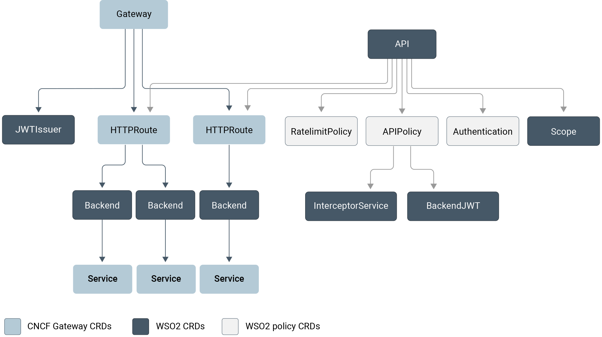

# APK Kubernetes CRD Catalog

WSO2 API management for Kubernetees now offers comprehensive support for the [Kubernetes Gateway API specification](https://gateway-api.sigs.k8s.io/). This support signifies a significant advancement in our API management for Kubernetees solution, enhancing our compatibility and integration capabilities within Kubernetes environments.

WSO2 API management for Kubernetes also supports the [metaresources and policy attachment specifications](https://gateway-api.sigs.k8s.io/references/policy-attachment/#supported-resources) defined by the Kubernetes Gateway API. These specifications provide a standardized approach to extending and configuring the behavior of objects within the Gateway API.

The diagram below displays the CRDs used within the WSO2 APK.
  

The catalogs of the CRDs, including examples and the configuration definitions, can be found below.

- [API](../../catalogs/crds/api_types)
- [HTTPRoute](../../catalogs/samples/http-route)
- [GRPCRoute](../../catalogs/samples/grpc-route)
- [Authentication](../../catalogs/crds/authentication_types)
- [Backend](../../catalogs/crds/backend_types)
- [BackendJWT](../../catalogs/crds/backendjwt_types)
- [APIPolicy](../../catalogs/crds/apipolicy_types)
- [Interceptor Service](../../catalogs/crds/interceptorservice_types)
- [RateLimitPolicy](../../catalogs/crds/ratelimitpolicy_types)
- [Scope](../../catalogs/crds/scope_types)
- [TokenIssuer](../../catalogs/crds/tokenIssuer_types)
