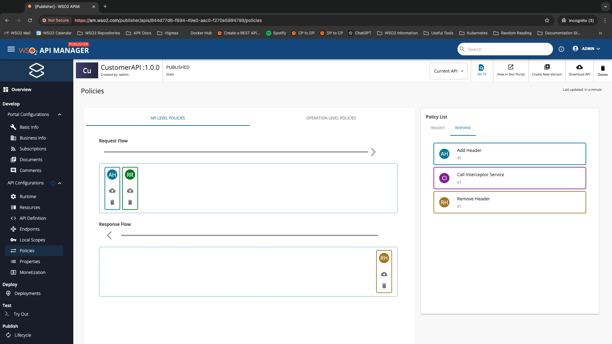
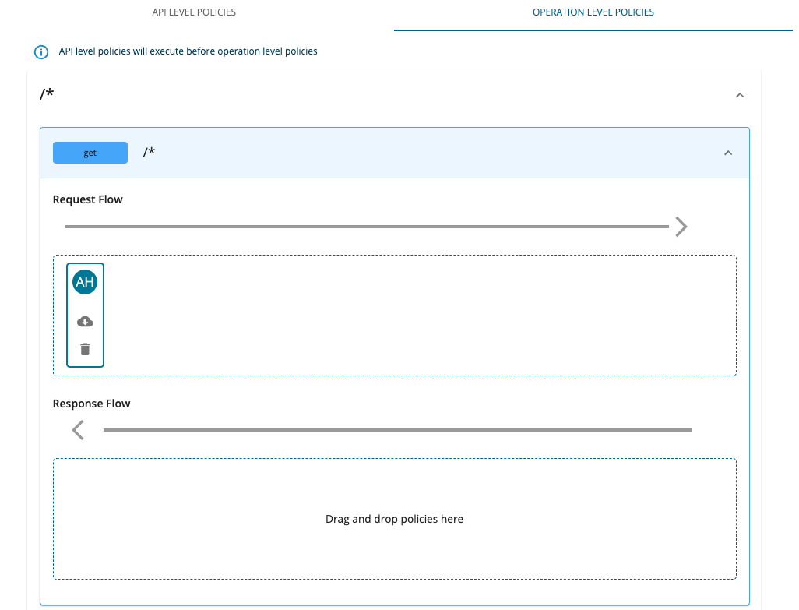
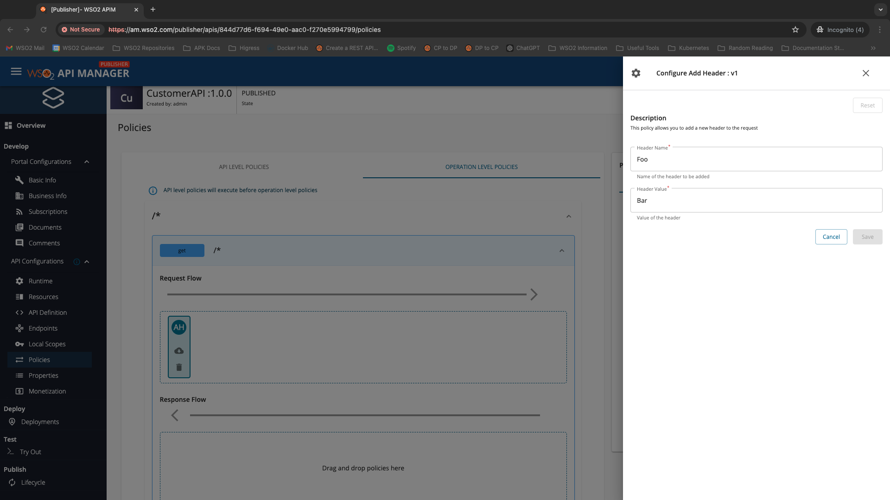

## Attaching Policies

Follow the instructions below to attach one or more default policies to an existing API.

1. Sign in to the WSO2 API Publisher at [https://am.wso2.com/publisher](https://am.wso2.com/publisher){:target="_blank"}.

2. Click on the API for which you want to attach policies to. Navigate to **API Configurations** → **Policies**.

3. First let us consider the **API Level Policies** tab. You can attach any number of policies by dragging and dropping from the policy list to the dropzone appearing under the desired flow (i.e. request or response). Since these policies are attached to the API level, upon API invocation these policies are engaged regardless of the resource that was invoked.

    !!! Note
        API level policies will execute before operation level policies.

4. Now let us consider the **Operation Level Policies** tab. Pick out the desired operation and flow to which you want to attach policies. Once that is decided, you can expand that API operation. At this point you will notice that by default the UI will open up the first API operation on initial page visit.

5. Let’s attach a policy to the operation. Scroll down through the left side column of the UI and click on the operation. You should be able to see the below screen when the API operation is expanded.

6. Drag the **Add Header** policy from the **Request** tab of the **Policy List** and drop that to the **Request Flow** dropzone of the first operation. You will notice a side panel appearing from the right hand side. Fill the required details using the values provided below. Then, click **Save**.

| Field        | Sample Value |
| ------------ | ------------ |
| Header Name  | Foo          |
| Header Value | Bar          |

!!! Note
    You can optionally use the **Apply to all** resources option to attach the same policy to all the resources. This will attach the same policy to all the API operations along with the values you entered to configure the policy (if any). It is important to note that if the policy was applied to the Request Flow, it will only be applied to all the request flows of all operations.

7. Now that we have saved the dropped policy, you should be able to see the attached **Add Header** policy (depicted with the initials `AH`).

8. If you click on this newly attached **AH** (i.e. Add Header) policy, you should still be able to view/edit values that you entered initially.

You can attach as many policies as you want for the operation.

9. Finally, when you are satisfied with the dragged and dropped policies, you can go ahead and click on the **Save** button at the bottom of the page. Note that if you do not click on save, none of the dropped policies will be saved to the API.