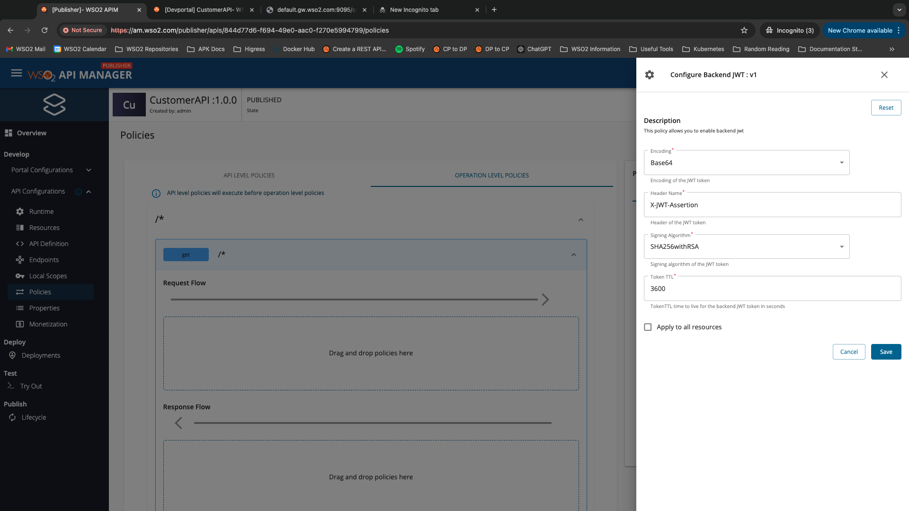

# Passing End User Attributes to the Backend

There can be scenarios where a backend service needs to make different decisions or respond with different data, depending on the application end-user that consumes an API. To achieve this the backend service needs to have access to the respective end-user's data at the time an API call takes place.

This can be facilitated by the Gateway by sending the end user attributes that are defined in the respective user store, in a JWT via an HTTP header, to the backend service when the API call is being forwarded.

## How does it work?

The backend JSON Web Token (JWT) contains the claims that are transferred between two parties, such as the end-user and the backend. A claim is an attribute of the user that is mapped to the underlying user store. A set of claims is referred to as a dialect (e.g., http://wso2.org/claims).

If you enable backend JWT generation in the Gateway, each API request will carry a digitally signed JWT, which is in the following format to the backend service.
 
`{token header}.{claims list}.{signature}`

When the request goes through the Gateway, the backend JWT is appended as a transport header to the outgoing message. The backend service fetches the JWT and retrieves the required information about the user, application, or token.

To enable backend JWT for an API or an operation, you can add a policy as follows.

The following values need to be added to the policy.

| Field             | Description                                                                               |
| ----------------- | ----------------------------------------------------------------------------------------- |
| Encoding          | The encoding mechanism used to encode the Backend JWT.                                    |
| Signing Algorithm | The signing algorithm used to sign the Backend JWT.                                       |
| Header Name       | The name of the HTTP header to which the Backend JWT is attached and sent to the backend. |
| Token TTL         | The expiry time of the Backend JWT.                                                       |