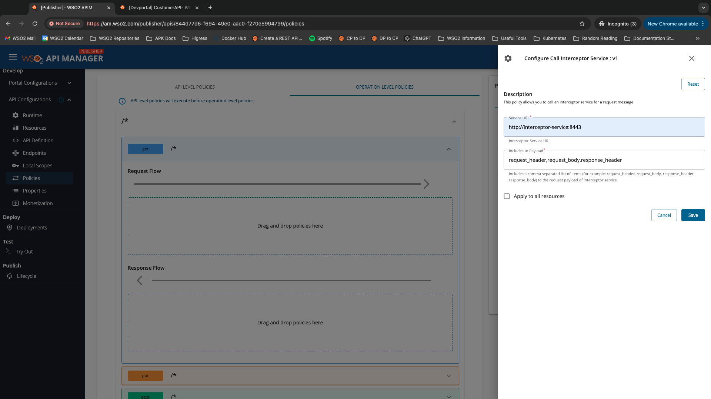

You can use interceptors to carry out transformations and mediation on the requests and responses. Request interceptor gets triggered before sending the request to the backend. Response interceptor gets triggered before responding to the client. Here, an interceptor is a separate microservice that handles the request, response, or both request and response transformations.

When you have attached an Interceptor `APIPolicy` like above example to your `API`, then the request flow (`1`, `2`, `3`, and `4` numbered circles) and response flow (`5`, `6`, `7`, and `8` numbered circles) can be depicted as below.

If you are an API developer, you can write a custom request/response interceptor microservice in any programming language of your choice by following [the Interceptor OpenAPI Definition](https://github.com/wso2/apk/blob/main/developer/resources/interceptor-service-open-api-v1.yaml){:target="_blank"}. Then you can provide the endpoint of the microservice to the Interceptor policy and then save and redeploy the API.

## Configuring Interceptors

Configuring an interceptor requires the following two steps.

1. [Implement an interceptor microservice adhering to the Interceptor OpenAPI Definition](https://apim.docs.wso2.com/en/4.2.0/deploy-and-publish/deploy-on-gateway/choreo-connect/message-transformation/interceptor-microservice/interceptor-microservice/){:target="_blank"}
For reference, a sample interceptor service for data conversion between application/json and application/xml data types with interceptor policy CRs can be found here: [request-response-mediation-interceptors](https://github.com/wso2/apk/tree/main/samples/request-response-mediation-interceptors){:target="_blank"}

2. Create the Interceptor Policy from the APIM Publisher window as follows.

The following fields need to added.

| Field Name          | Description                                                                                                                                                                                                     |
| ------------------- | --------------------------------------------------------------------------------------------------------------------------------------------------------------------------------------------------------------- |
| Service URL         | The endpoint of the interceptor microservice                                                                                                                                                                    |
| Includes to payload | The content of the payload that must be sent to the interceptor. Possible values include: request_headers, request_body, request_trailer, response_headers, response_body, response_trailer, invocation_context |
