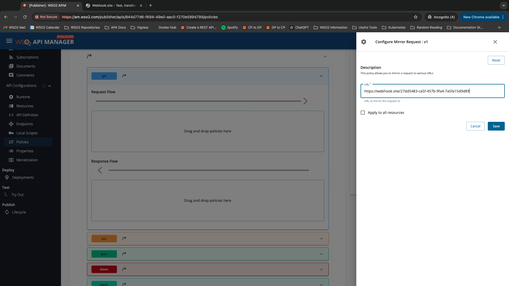

Request mirroring allows traffic to be duplicated and sent to additional backends for testing and monitoring purposes. This feature is particularly useful for scenarios where you want to test changes or monitor the behavior of your application under different conditions without affecting the primary production or sandbox environment. The Request Mirror filter can mirror requests to different backends apart from the primary backend defined in the production or sandbox endpoints.

The current implementation operates in a “fire and forget” manner, and only the response from the primary endpoint will be returned. This allows for the assessment of changes in a real-world environment without impacting the actual user experience. This method ensures that the production environment remains stable while providing insights into how updates or modifications would perform under actual load conditions.

For request mirroring, add the URL you want the request to be mirrored to in the Mirror Request Policy as shown below.

When this operation is invoked, the request will then be sent to the URL added in the policy and the backend URL.