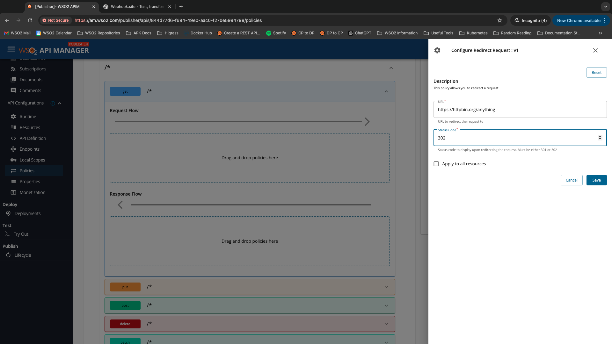
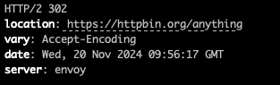

Request redirection allows you to send clients to a different URL. This can be useful for changing old URLs to new ones or directing traffic based on specific conditions. Request redirection can be configured via the apk-conf file as follows.

The redirect request policy requires two values:

1. The URL to be shown in the location header in the response
2. The status code to be shown in the response

These values can be provided in the redirect request policy as follows.

Once you have saved the above policy and redeployed the API, when you invoke the operation you added the redirect policy to, you will get a response similar to the following.

The location header and the status code contain the values that were specified in the request redirect policy.