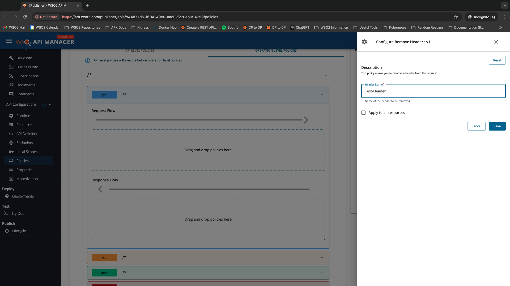

Web services may contain response headers with sensitive information. This header can be used to remove HTTP request headers from the responses for security reasons.

To remove headers from requests or responses for an API or an API operation, add the name of the header to be removed as a property in the header policy, as shown below.

If the remove header policy is applied to the Request flow, the header will be removed from the request body and sent to the backend.

If the remove header policy is applied to the Response flow, the header will be removed from the response body and sent back to the client.

!!! note
    While interceptors can be used for header modification as well, it is recommended to use the Add Header and Remove Header policies for that scenario, and use Interceptor policies for more advanced use cases.