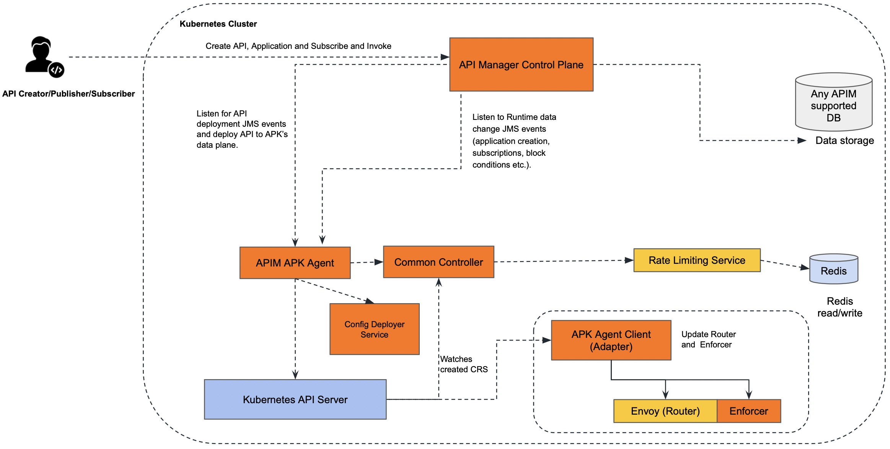

# Kubernetes Gateway as Gateway in API Manager

## Overview

The Control Plane serves as the central intelligence hub for WSO2 Kubernetes Gateway, orchestrating the entirety of the API ecosystem. It encompasses critical functionalities such as API management, administrative operations, and the API marketplace. Structurally, it comprises four principal components: the Back Office, Dev Portal, Admin Portal, and Kubernetes Gateway Agent. These components cater to diverse user roles, ranging from API product managers to consumers and administrative personnel. Within the Control Plane, users configure, oversee, and track the performance of APIs, ensuring seamless management and optimization of the API landscape.

For the Kubernetes Gateway Control Plane, we are going to use same WSO2 API Manager Control Plane. The WSO2 API Manager control plane is a set of components that are responsible for managing and monitoring APIs.
Kubernetes Gateway Only supports REST API and GraphQL API creation for now.

## Architecture

Following diagram depicts the architecture of how the WSO2 APIM Control Plane connects with WSO2 Kubernetes Gateway using Kubernetes Gateway Agent.

## Kubernetes Gateway Agent

The Kubernetes Gateway Agent is a component that connects the WSO2 API Manager (APIM) control plane with the WSO2 Kubernetes Gateway. The Kubernetes Gateway Agent is responsible for the following tasks:

- Receive JMS Events which relates to API, Application, Subscription management from the APIM Control Plane.
- Convert the data which is received from the APIM Control Plane to the Kubernetes Gateway understandable format which are K8s Custom Resources.
- Apply the generated Custom Resources to the K8s cluster to deploy API to Kubernetes Gateway.

## Supported Features

- API Management: Manage APIs, including creating, publishing, and retiring APIs.
- Application Management: Manage applications that consume APIs, including subscription management.
- Subscription Management: Manage subscriptions to APIs by applications.
- API Analytics: Gather and analyze data on API usage and performance.
- API Marketplace: Provide a marketplace for discovering and consuming APIs.
- Integration with WSO2 Kubernetes Gateway: Integrate with the Kubernetes Gateway for deploying APIs and managing traffic.

You can refer the <a href="../api-management/control-plane-api-management-overview" target="_blank">Control Plane API Management Overview</a> for more details on the supported and unsupported features.

## Next Steps

You can refer the [Quick Start Guide](apk-as-gateway-in-apim-qsg.md) regards to trying out API Manager Control Plane with Kubernetes Gateway using Kubernetes Gateway Agent.

    