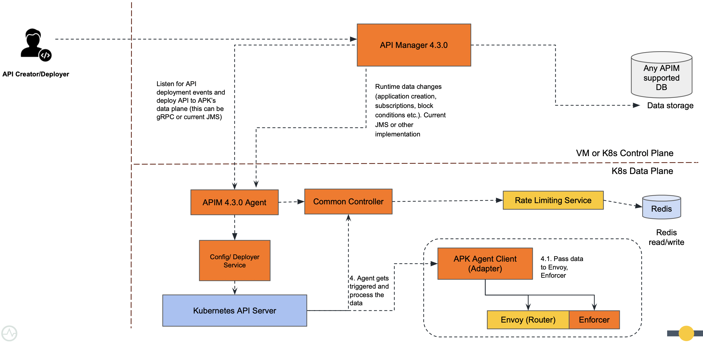

# Control Plane

## Overview

The Control Plane serves as the central intelligence hub for WSO2 APK, orchestrating the entirety of the API ecosystem. It encompasses critical functionalities such as API management, administrative operations, and the API marketplace. Structurally, it comprises four principal components: the Back Office, Dev Portal, Admin Portal, and APIM-APK Agent. These components cater to diverse user roles, ranging from API product managers to consumers and administrative personnel. Within the Control Plane, users configure, oversee, and track the performance of APIs, ensuring seamless management and optimization of the API landscape.

For the APK Control Plane, we are going to use same WSO2 API Manager Control Plane. The WSO2 API Manager control plane is a set of components that are responsible for managing and monitoring APIs. The control plane is responsible for the following tasks: 

- API gateway management
- API lifecycle management
- API publishing and subscription
- API analytics
- API monetization
- API security
- API documentation
- API versioning
- API rate limiting
- API throttling
- API mediation

APK Only supports REST API and GraphQL API creation for now.

## Architecture

Following diagram depicts the architecture of how the WSO2 APIM Control Plane connects with WSO2 APK Gateway using APIM-APK Agent.

## Next Steps

You can refer the [Control Plane Configuration](../control-plane/control-plane-configuration.md) regards to configuring API Manager Control Plane with APK Gateway using APIM-APK Agent.

    