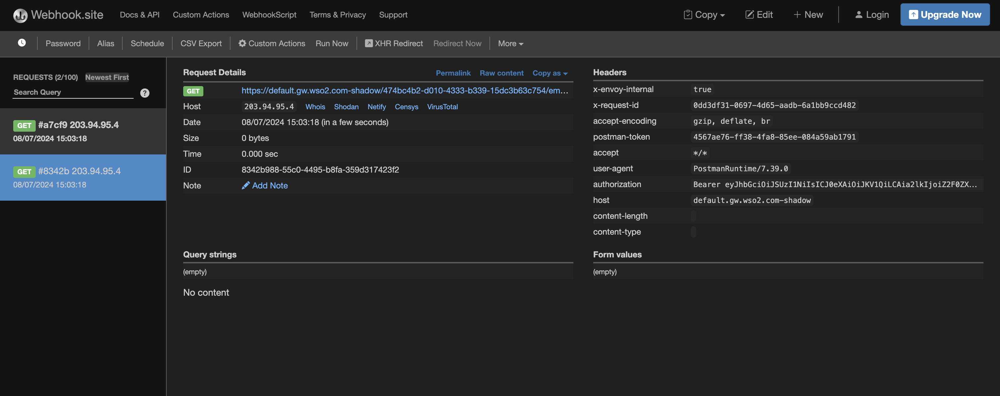

# Mirroring Requests via CRs

This functionality enables request mirroring, where a request can be duplicated and sent to multiple backends for testing and monitoring. This guide explains how to enable request mirroring via Kubernetes CRs.

### Step 1 - Get the CRs for the relevant API configuration

Here, you can follow the steps in [Develop and Deploy a REST API via CRs](../../create-and-deploy-apis/rest/create-rest-api-using-crs.md) documentation and create the CRs to deploy an API from scratch. 

Alternatively, you can generate the CRs for a given apk-conf file using the steps as detailed in [this section]({{base_path}}/en/latest/api-management-overview/tools-for-api-development/#option-2-generate-k8s-custom-resources-using-config-generator-tool-and-deploy-the-api-using-kubernetes-client)

### Step 2 - Add the header modification filters to the HTTPRoute CR

Header modification can be done using an HTTPRoute filter as follows.

First, create the relevant Backend CR to mirror the request to. A sample Backend CR is provided below.

```
apiVersion: "dp.wso2.com/v1alpha1"
kind: "Backend"
metadata:
  name: "mirror-backend"
spec:
  services:
    - host: "webhook.site"
      port: 443
  basePath: "/30cd1472-d4ac-4440-ab8d-66fc0a789c7b"
  protocol: "https"
```

Then you can refer to this CR in your HTTPRoute CR as follows.

```
filters:
  - type: "RequestMirror"
    requestMirror:
      backendRef:
        group: "dp.wso2.com"
        kind: "Backend"
        name: "mirror-backend"
```

The complete sample HTTPRoute is as follows.

```
apiVersion: "gateway.networking.k8s.io/v1beta1"
kind: "HTTPRoute"
metadata:
  name: "production-httproute"
spec:
  hostnames:
  - "default.gw.wso2.com"
  rules:
  - matches:
    - path:
        type: "RegularExpression"
        value: "/employee"
      method: "GET"
    filters:
    - type: "RequestMirror"
      requestMirror:
        backendRef:
          group: "dp.wso2.com"
          kind: "Backend"
          name: "mirror-backend"
  parentRefs:
  - group: "gateway.networking.k8s.io"
    kind: "Gateway"
    name: "wso2-apk-default"
    sectionName: "httpslistener"
```

This policy mirrors the request to the production/sandbox endpoint, as well as the relevant mirror URL.

### Step 3 - Deploy the API in APK

You can deploy the API using the following command. Replace <namespace> with the correct namespace.
```
kubectl apply -f . -n <namespace>
```

### Step 4 - Generate an access token

Follow the [Generate Access Token](../../../develop-and-deploy-api/security/generate-access-token.md) documentation to generate an access token.

### Step 5 - Invoke the API

You can invoke the API using the following command.

```
curl --location 'https://default.gw.wso2.com:9095/employee/1.0/employee' \
--header 'Host: default.gw.wso2.com' \
--header 'Authorization: Bearer <accessToken>
```

Once you have invoked the above, you can view the duplicated requests in the webhook.site page as follows.

[](../../../assets/img/api-management/api-policies/webhook-site-request-mirroring.png)