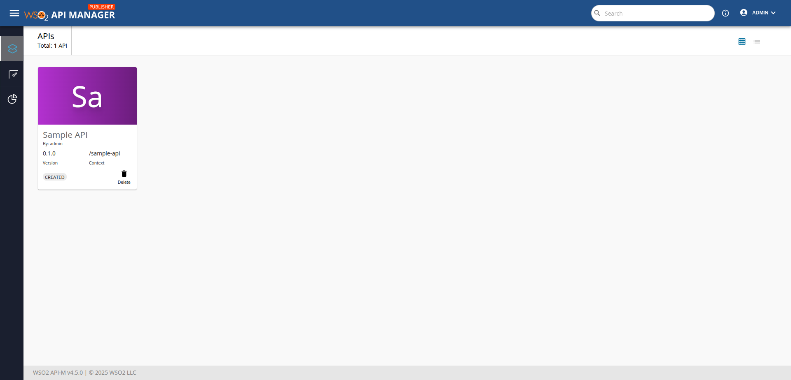
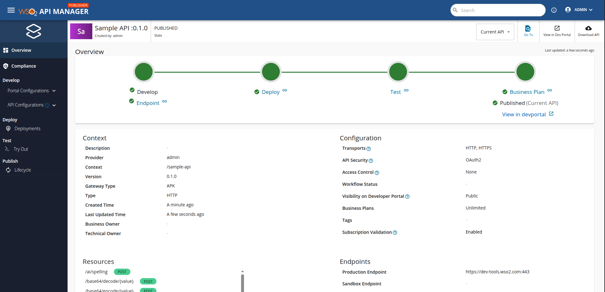
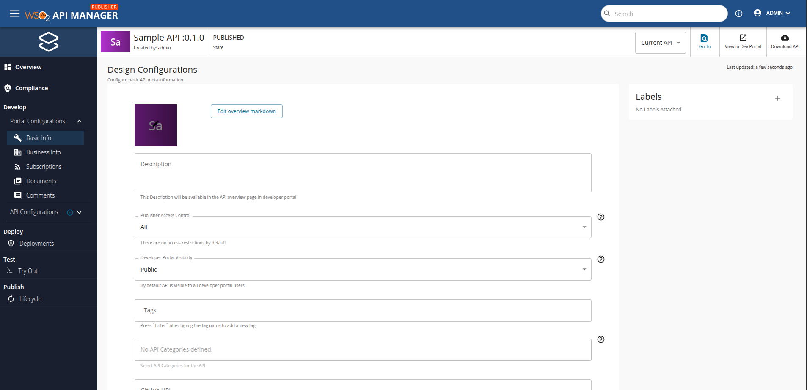

# Developer-Driven Design First API Management 

This section provides a step-by-step guide to creating, deploying, and invoking an API using the WSO2 API Platform for Kubernetes integrated with the Control Plane. It also covers how to create an API from the data plane using CR and APIs.

!!!NOTE
    To set up the APK as an enterprise version, please follow the steps specified in both the [Install APK Enterprise](../setup/enterprise-apk-install) and [Install APIM APK Agent Enterprise](../setup/enterprise-apim-apk-agent-install.md) sections.

!!!NOTE
    If you follow this approach, **you cannot create APIs from Portal UI**. If you need that approach, go to [Portal-Driven Design First](../quick-start-guide-as-gateway) section.

## Before you begin...

Install the [prerequisites](../../setup/prerequisites) that are required to run the WSO2 API Platform for Kubernetes.

!!!NOTE
    If you already have an installation of the APK in your cluster, please remove the installation by following the steps specified in the [Uninstall APK](../setup/uninstall.md) section.

## Step 1 - Setup WSO2 API Platform For Kubernetes With Control Plane

{!includes/start-apk-cp.md!}

## Step 2 - Create and Deploy the API From Dataplane

1. Save and download the sample [EmployeeServiceDefinition.json](../assets/files/get-started/EmployeeServiceDefinition.json) file. This is the OAS definition of the API that we are going to deploy in APK.
2. Add a hostname mapping to the ```/etc/hosts``` file as follows.

    | IP        | Domain name              |
    | --------- | ------------------------ |
    | 127.0.0.1 | api.am.wso2.com          |
    | 127.0.0.1 | am.wso2.com              |
    | 127.0.0.1 | idp.am.wso2.com          |
    | 127.0.0.1 | default.gw.wso2.com      |
    | 127.0.0.1 | carbon.super.gw.wso2.com |

!!! info "(Optional) To access the deployment through your local machine"

    1. Identify the `gateway-service` external IP address.
        ```console
        kubectl get svc -n apk | grep gateway-service
        ```
    2. Port forward router service to localhost.
        ```console
        kubectl port-forward svc/apk-wso2-apk-gateway-service 9095:9095 -n apk
        ```

### Generate APK configuration file from the OpenAPI definition

Apart from the above API definition file, we also need an `apk-conf` file that defines the configurations and metadata for this API. We have a configuration service that can be used to generate this apk-conf file when the OpenAPI definition is provided.


1. Execute the following request to generate the APK configuration. Use the values provided in the table below in the body of your request. 

    | Field      | Value                                                                                                                     |
    | ---------- | ------------------------------------------------------------------------------------------------------------------------- |
    | definition | `EmployeeServiceDefinition.json` file that was downloaded at the beginning of [Step 2](#step-2-create-and-deploy-the-api) |

    === "Sample Request"
        ```
        curl -k --location 'https://api.am.wso2.com:9095/api/configurator/1.2.0/apis/generate-configuration' \
        --header 'Host: api.am.wso2.com' \
        --form 'definition=@"/Users/user/EmployeeServiceDefinition.json"' > EmployeeService.apk-conf
        ```

    === "Sample Response"
        ```
        ---
        name: "EmployeeServiceAPI"
        basePath: "/RW1wbG95ZWVTZXJ2aWNlQVBJMy4xNA"
        version: "3.14"
        type: "REST"
        defaultVersion: false
        endpointConfigurations:
            production:
                endpoint: "http://employee-service:80"
        operations:
        - target: "/employee"
            verb: "GET"
            secured: true
            scopes: []
        - target: "/employee"
            verb: "POST"
            secured: true
            scopes: []
        - target: "/employee/{employeeId}"
            verb: "PUT"
            secured: true
            scopes: []
        - target: "/employee/{employeeId}"
            verb: "DELETE"
            secured: true
            scopes: []
        ```

    === "Request Format"
        ```
        curl --location 'https://<host>:9095/api/configurator/1.2.0/apis/generate-configuration' \
        --header 'Host: <host>' \
        --form 'apiType="<api-type>"' \
        --form 'definition=@"<path/to/EmployeeServiceDefinition.json>"'
        ```


2. You will get the apk-conf file content as the response. Save this content into a file named `EmployeeService.apk-conf`.

!!! Important
    We recommend installing the [APK Config Language Support Visual Studio Code (VS Code) extension]({{base_path}}/en/latest/api-management-overview/apk-conf-lang-support/) to edit the APK Configuration file.


### Deploy the API in APK DataPlane

You now have the API Definition (`EmployeeServiceDefinition.json`) and the apk-conf file (`EmployeeService.apk-conf`) corresponding to the API. We can use these files to deploy the API in APK. 

1. Use the values provided in the table below in the body of your request.

    | Field            | Value                                 | Required         |
    | ---------------- | ------------------------------------- | ---------------- |
    | apkConfiguration | `EmployeeService.apk-conf` file       | :material-check: |
    | definitionFile   | `EmployeeServiceDefinition.json` file | :material-check: |

2. Set the access token in the Authorization header as a bearer token. This is the access token received by following the steps under the ["Generate an access token to invoke APIs"](#generate-an-access-token-to-invoke-apis) section above.

3. You can generate K8s resources as a zip file from config-deployer service using below command.

    === "Sample Request"
        ```
        curl --location 'https://api.am.wso2.com:9095/api/configurator/1.2.0/apis/generate-k8s-resources?organization=carbon.super' \
        --header 'Content-Type: multipart/form-data' \
        --header 'Accept: application/zip' \
        --form 'apkConfiguration=@"/Users/user/EmployeeService.apk-conf"' \
        --form 'definitionFile=@"/Users/user/EmployeeServiceDefinition.json"' \
        -k --output ./api-crds.zip
        ```

3. Once you have generated your K8s artifacts, the next step is to apply them to  the Kubernetes API server.

        ```
        kubectl apply -n apk -f <path_to_extracted_zip_file>
        ```

4. Execute the command below. You will be able to see that the `EmployeeServiceAPI` is successfully deployed as shown in the image.


    === "Command"
        ```
        kubectl get apis -n apk
        ```

    [](../assets/img/get-started/deployed-api.png)

## Step 3 - Create the Backend

The endpoint "http://employee-service:80" provided in the above files points to a backend deployed on a kubernetes service. Prior to invoking the API, you will need to have this backend up. 

We have provided the file containing this sample backend [here](../assets/files/get-started/employee-service-backend.yaml). Download it and create the backend service using the following command.

```
kubectl apply -f ./employee-service-backend.yaml -n apk
```

Wait for this pod to spin up. You can check its status using the following command.

```
kubectl get pods -n apk
```

## Step 4 - Manage API From Control Plane

1. Login to the Publisher Console ([https://am.wso2.com/publisher](https://am.wso2.com/publisher)) of the WSO2 API Manager.

    you can see the deploy EmployeeService API as below.

    [](../assets/img/control-plane/cp-overview.png)

2. Once you click the API you will redirect to overciew page.

    [](../assets/img/control-plane/main-overview.png)

3. Now you can edit portal cnfigurations such as basic info, documentation etc.

    [](../assets/img/control-plane/portal-conf.png)

4. Finally publish to developer portal.


## Step 5 - Create Application and Subscribe to the API

1. Login to the Developer Portal ([https://am.wso2.com/devportal](https://am.wso2.com/devportal)) of the WSO2 API Manager.
2. Click on the `Applications` tab and then use `ADD NEW APPLICATION` option.
3. Provide the information as given below and click `Save`.

     <html>
        <table>
        <th>Field</th><th>Value</th>
        <tr><td>Application Name</td><td>EmpolyeeServiceApp</td></tr>
        <tr><td>Per Token Quota</td><td>10PerMin</td></tr>
        <tr><td>Description</td><td>Petstore Application</td></tr>
        </table>
     </html>

4. Click **Subscriptions** to subscribe to the created EmployeeServiceAPI.
5. Click **Production Keys** or **Sandbox Keys** based on the environment for which you need to generate keys.
   Let's assume that you are working in a production environment. Therefore, click **Production Keys**.
5. Click **Generate Keys** to create an application Access Token with relevant scopes.
6. To verify the Application and Subscription creation in the APK Gateway, execute the following command. You will see the status of the deployed application as follows once completed.

    ```bash
    kubectl get subscriptions -n apk
    kubectl get applications -n apk
    ```

## Step 6 - Invoke the API

1. Use the following command to invoke the API using the access token generated in the previous step.

    ```bash
    curl -X GET "https://carbon.super.gw.wso2.com:9095/RW1wbG95ZWVTZXJ2aWNlQVBJMy4xNA/3.14/employee" -H "Authorization: Bearer <access-token>" -k
    ```

You will now be able to see a successful response with the details of the Employees from the mock backend that we used for this guide.

