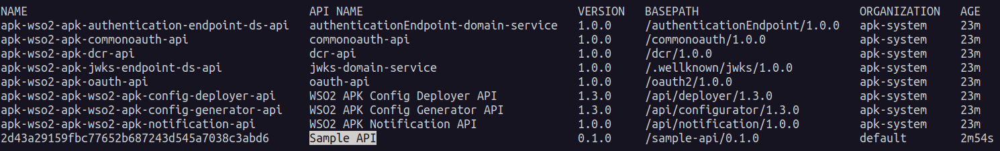

# Developer-Driven Design First API Management 

This section provides a step-by-step guide to creating, deploying, and invoking an API using the WSO2 Kubernetes Gateway integrated with the Control Plane. It also covers how to create an API from the data plane using CR and APIs.

!!!NOTE
    To set up the Kubernetes Gateway as an enterprise version, please follow the steps specified in both the <a href="../../setup/enterprise-apk-install" target="_blank">Install WSO2 Kubernetes Gateway Enterprise</a> and <a href="../../setup/enterprise-apim-apk-agent-install" target="_blank">Install WSO2 Kubernetes Gateway Agent Enterprise</a>.

!!!NOTE
    If you follow this approach, **you cannot create APIs from Portal UI**. If you need that approach, go to <a href="../quick-start-guide-as-gateway" target="_blank">Portal-Driven Design First</a> section.

## Before you begin...

Install the <a href="../../setup/prerequisites" target="_blank">prerequisites</a> that are required to run the WSO2 Kubernetes Gateway.

!!!NOTE
    If you already have an installation of the Kubernetes gateway in your cluster, please remove the installation by following the steps specified in the <a href="../../setup/uninstall" target="_blank">Uninstall Kubernetes Gateway</a>  section.

## Step 1 - Setup WSO2 Kubernetes Gateway With Control Plane

{!includes/start-apk-cp.md!}

## Step 2 - Create and Deploy the API From Dataplane

1. Download and save the sample <a href="../../assets/files/get-started/SampleAPIDefinition.json" target="_blank" download>SampleAPIDefinition.json</a> file. This is the OAS definition of the API that we are going to deploy in Kubernetes Gateway.
2. Add a hostname mapping to the ```/etc/hosts``` file as follows.

    | IP        | Domain name              |
    | --------- | ------------------------ |
    | 127.0.0.1 | api.am.wso2.com          |
    | 127.0.0.1 | am.wso2.com              |
    | 127.0.0.1 | idp.am.wso2.com          |
    | 127.0.0.1 | default.gw.wso2.com      |
    | 127.0.0.1 | carbon.super.gw.wso2.com |

!!! info "(Optional) To access the deployment through your local machine"

    1. Identify the `gateway-service` external IP address.
        ```console
        kubectl get svc -n apk | grep gateway-service
        ```
    2. Port forward router service to localhost.
        ```console
        kubectl port-forward svc/apk-wso2-apk-gateway-service 9095:9095 -n apk
        ```

### Generate Kubernetes Gateway configuration file from the OpenAPI definition

Apart from the above API definition file, we also need an `apk-conf` file that defines the configurations and metadata for this API. We have a configuration service that can be used to generate this apk-conf file when the OpenAPI definition is provided.


1. Execute the following request to generate the Kubernetes Gateway API configuration. Use the values provided in the table below in the body of your request. 

    | Field      | Value                                                                                                               |
    | ---------- | ------------------------------------------------------------------------------------------------------------------- |
    | definition | `SampleAPIDefinition.json` file that was downloaded at the beginning of [Step 2](#step-2-create-and-deploy-the-api) |

    === "Sample Request"
        ```
        curl -k --location 'https://api.am.wso2.com:9095/api/configurator/1.3.0/apis/generate-configuration' \
        --header 'Host: api.am.wso2.com' \
        --form 'definition=@"/Users/user/SampleAPIDefinition.json"' > SampleService.apk-conf
        ```

    === "Sample Response"
        ```
        ---
        name: "Sample API"
        basePath: "/U2FtcGxlIEFQSTAuMS4w"
        version: "0.1.0"
        type: "REST"
        defaultVersion: false
        subscriptionValidation: false
        endpointConfigurations:
            production:
            - endpoint: "https://dev-tools.wso2.com/gs/helpers/v1.0"
        operations:
        - target: "/ai/spelling"
        verb: "POST"
        secured: true
        scopes: []
        - target: "/base64/decode/{value}"
        verb: "POST"
        secured: true
        scopes: []
        - target: "/base64/encode/{value}"
        verb: "POST"
        secured: true
        scopes: []
        - target: "/ip"
        verb: "GET"
        secured: true
        scopes: []
        - target: "/user-agent"
        verb: "GET"
        secured: true
        scopes: []
        - target: "/uuid"
        verb: "GET"
        secured: true
        scopes: []
        ```

    === "Request Format"
        ```
        curl --location 'https://<host>:9095/api/configurator/1.3.0/apis/generate-configuration' \
        --header 'Host: <host>' \
        --form 'apiType="<api-type>"' \
        --form 'definition=@"<path/to/SampleAPIDefinition.json>"'
        ```


2. You will get the apk-conf file content as the response. Save this content into a file named `SampleService.apk-conf`. You can edit these values as necessary. Let's change the basepath from the autogenerated value to "/sample-api". Your apk-conf file should now appear as follows.

```
---
name: "Sample API"
basePath: "/sample-api"
version: "0.1.0"
type: "REST"
defaultVersion: false
subscriptionValidation: false
endpointConfigurations:
    production:
    - endpoint: "https://dev-tools.wso2.com/gs/helpers/v1.0"
operations:
- target: "/ai/spelling"
  verb: "POST"
  secured: true
  scopes: []
- target: "/base64/decode/{value}"
  verb: "POST"
  secured: true
  scopes: []
- target: "/base64/encode/{value}"
  verb: "POST"
  secured: true
  scopes: []
- target: "/ip"
  verb: "GET"
  secured: true
  scopes: []
- target: "/user-agent"
  verb: "GET"
  secured: true
  scopes: []
- target: "/uuid"
  verb: "GET"
  secured: true
  scopes: []
```

!!! Important
    We recommend installing the <a href="../../api-management-overview/apk-conf-lang-support/" target="_blank">Kubernetes Gateway Config Language Support Visual Studio Code (VS Code) extension</a> to edit the Kubernetes Gateway API Configuration file.


### Deploy the API in Kubernetes Gateway

You now have the API Definition (`SampleAPIDefinition.json`) and the apk-conf file (`SampleService.apk-conf`) corresponding to the API. We can use these files to deploy the API in Kubernetes Gateway. 

1. Use the values provided in the table below in the body of your request.

    | Field            | Value                           | Required         |
    | ---------------- | ------------------------------- | ---------------- |
    | apkConfiguration | `SampleService.apk-conf` file   | :material-check: |
    | definitionFile   | `SampleAPIDefinition.json` file | :material-check: |


2. You can generate the Kubernetes custom resources as a zip file from the config-deployer service using the following command.

    === "Sample Request"
        ```
        curl --location 'https://api.am.wso2.com:9095/api/configurator/1.3.0/apis/generate-k8s-resources?organization=carbon.super' \
        --header 'Content-Type: multipart/form-data' \
        --header 'Accept: application/zip' \
        --form 'apkConfiguration=@"/Users/user/SampleService.apk-conf"' \
        --form 'definitionFile=@"/Users/user/SampleAPIDefinition.json"' \
        -k --output ./api-crds.zip
        ```

    === "Request Format"
        ```
        curl --location 'https://<host>:9095/api/configurator/1.3.0/apis/generate-k8s-resources?organization=carbon.super' \
        --header 'Content-Type: multipart/form-data' \
        --header 'Accept: application/zip' \
        --form 'apkConfiguration=@"<path/to/apk-conf-file.apk-conf>"' \
        --form 'definitionFile=@"<path/to/definition-file.json>"' \
        -k --output <path/and/name-for-generated-zip-file.zip>
        ```

3. Once you have generated your K8s artifacts, the next step is to apply them to  the Kubernetes API server.

    ```
    kubectl apply -n apk -f <path_to_extracted_zip_file>
    ```

4. Execute the command below. You will be able to see that the `SampleServiceAPI` is successfully deployed as shown in the image.


    === "Command"
        ```
        kubectl get apis -n apk
        ```

    [](../assets/img/get-started/deployed-api.png)

## Step 3 - Manage API From Control Plane

1. Login to the Publisher Console (<a href="https://am.wso2.com/publisher" target="_blank">https://am.wso2.com/publisher</a>) of the WSO2 API Manager.

    you can see the deployed SampleService API as below.

    [](../assets/img/control-plane/cp-overview.png)

2. Once you click the API you will be redirected to the overview page.

    [](../assets/img/control-plane/main-overview.png)

3. Now you can edit portal configurations such as basic info, documentation etc.

    [](../assets/img/control-plane/portal-conf.png)

4. Finally publish to developer portal.


## Step 4 - Create Application and Subscribe to the API

1. Login to the Developer Portal (<a href="https://am.wso2.com/devportal" target="_blank">https://am.wso2.com/devportal</a>) of the WSO2 API Manager.
2. Click on the `Applications` tab and then use `ADD NEW APPLICATION` option.
3. Provide the information as given below and click `Save`.

     <html>
        <table>
        <th>Field</th><th>Value</th>
        <tr><td>Application Name</td><td>SampleServiceApp</td></tr>
        <tr><td>Per Token Quota</td><td>10PerMin</td></tr>
        <tr><td>Description</td><td>Sample Service Application</td></tr>
        </table>
     </html>

4. Click **Subscriptions** to subscribe to the created SampleServiceAPI.
5. Click **Production Keys** or **Sandbox Keys** based on the environment for which you need to generate keys.
   Let's assume that you are working in a production environment. Therefore, click **Production Keys**.
5. Click **Generate Keys** to create an application Access Token with relevant scopes.
6. To verify the Application and Subscription creation in the kubernetes gateway, execute the following command. You will see the status of the deployed application as follows once completed.

    ```bash
    kubectl get subscriptions -n apk
    kubectl get applications -n apk
    ```

## Step 5 - Invoke the API

1. Generate an access token by following the steps under <a href="../quick-start-guide#generate-an-access-token-to-invoke-apis" target="_blank">Generate an access token to invoke APIs</a> section.

2. Use the following command to invoke the API using the access token generated in the previous step.

    ```bash
    curl -X GET "https://carbon.super.gw.wso2.com:9095/sample-api/0.1.0/uuid" -H "Authorization: Bearer <access-token>" -k
    ```

You will now be able to see a successful response with the details of a random UUID from the sample backend that we used for this guide.