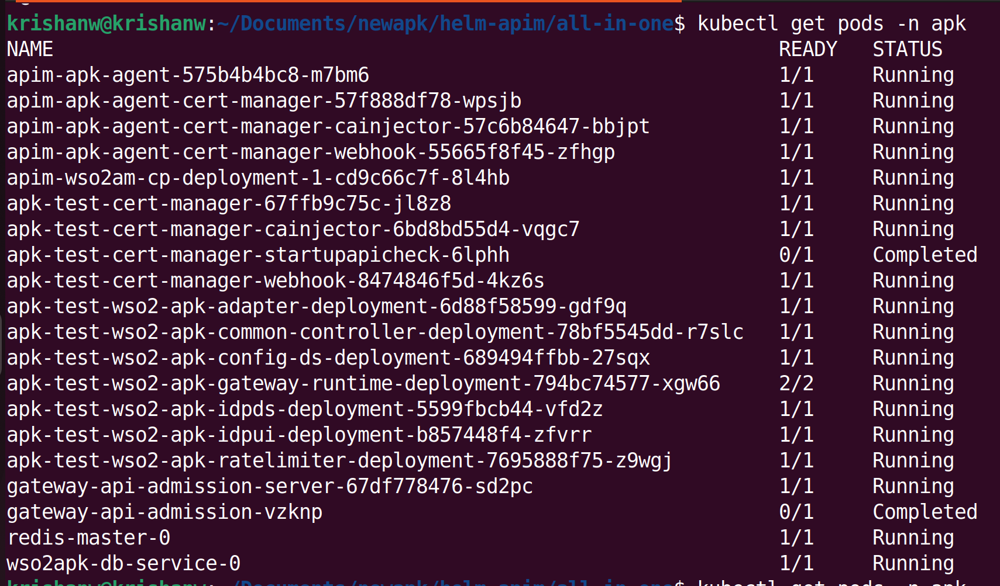

Follow the instructions below to deploy Kubernetes Gateway in the Kubernetes cluster.

### Create Kubernetes namespace

``` 
kubectl create ns apk
```

### Setup WSO2 API Manager Control Plane 4.5.0

Setup WSO2 API Manager 4.5.0 in K8s cluster using Helm Charts.

1. Create a new helm repository with the latest apim release using the following command. Let’s consider the ```<repository-name>``` as ```wso2apim```.

    ```console
    helm repo add wso2apim https://github.com/wso2/helm-apim/releases/download/acp-4.5.0-rc
    ```

2. Execute the following command to update the helm repositories.

    ```console
    helm repo update
    ```

3. Consider ```apim``` as the ```<chart-name>``` for this guide. As the ```--version``` of this command, use the version of the release you used in point 1 above. It will take a few minutes for the deployment to complete.

    === "Command"
        ```
        helm install apim wso2apim/wso2am-cp --version 4.5.0-rc -f https://raw.githubusercontent.com/wso2/apk/main/helm-charts/samples/apim/cp/apk-cp/4.5.0-values.yaml -n apk
        ```
    === "Format"
        ```
        helm install <chart-name> <repository-name>/wso2am-cp --version <version-of-APIM> -f <path-to-values.yaml-file>
        ```

4. Install NGINX Ingress Controller. Please refer to the <a href="https://kubernetes.github.io/ingress-nginx/deploy/#local-development-clusters" target="_blank">NGINX Ingress Controller</a> documentation for more information.

### Setup WSO2 Kubernetes Gateway 1.3.0

1. Create a new helm repository with the latest Kubernetes Gateway release using the following command. Let’s consider the ```<repository-name>``` as ```wso2apk```.

    ```console
    helm repo add wso2apk https://github.com/wso2/apk/releases/download/1.3.0-rc
    ```

2. Execute the following command to update the helm repositories.

    ```console
    helm repo update
    ```
   
3. Install the Kubernetes Gateway components and start WSO2 API Platform For Kubernetes. Consider ```apk``` as the ```<chart-name>``` for this guide. As the ```--version``` of this command, use the version of the release you used in point 1 above. It will take a few minutes for the deployment to complete.

    === "Command"
        ```
        helm install apk wso2apk/apk-helm --version 1.3.0-rc -f https://raw.githubusercontent.com/wso2/apk/main/helm-charts/samples/apk/1.3.0-values.yaml -n apk
        ``` 
    === "Format"
        ```
        helm install <chart-name> <repository-name>/apk-helm --version <version-of-APK> -f <path-to-values.yaml-file>
        ```


### Setup WSO2 Kubernetes Gateway Agent 1.3.0

1. Create a new helm repository with the latest kubernetes gateway agent release using the following command. Let’s consider the ```<repository-name>``` as ```wso2apkagent``` for this guide.

    ```console
    helm repo add wso2apkagent https://github.com/wso2/product-apim-tooling/releases/download/1.3.0-rc
    ```

2. Execute the following command to update the helm repositories.

    ```console
    helm repo update
    ```

3. Install the Kubernetes Gateway Agent components and start WSO2 Kubernetes Gateway. Consider ```apk``` as the ```<chart-name>``` for this guide. As the ```--version``` of this command, use the version of the release you used in point 1 above. It will take a few minutes for the deployment to complete.

    === "Command"
        ```
        helm install apim-apk-agent wso2apkagent/apim-apk-agent --version 1.3.0-rc -f https://raw.githubusercontent.com/wso2/apk/main/helm-charts/samples/apim-apk-agent/cp/1.3.0-values.yaml -n apk
        ```
    === "Format"
        ```
        helm install <chart-name> <repository-name>/apim-apk-agent --version <version-of-APK-Agent> -f <path-to-values.yaml-file>
        ```

### Verify the deployment

Now you can verify the deployment by executing the following command. You will see the status of the pods of Kubernetes Gateway and APIM Control plane as follows once completed.

=== "Command"
    ```
    kubectl get pods -n apk
    ```
    [](../assets/img/get-started/cp-podstatus.png)