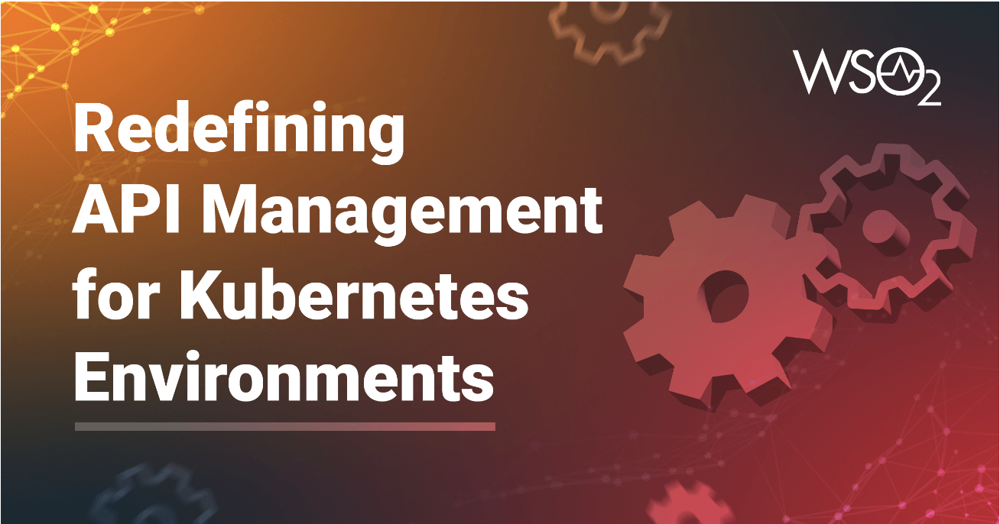

    

        

            

            
            

            

                APK is WSO2's cloud native API management platform. APK is designed to help you build, deploy, and manage APIs in a cloud environment. Our platform is built on top of a microservices architecture and uses containerization technologies to ensure scalability and flexibility. With features like automatic failover and load balancing, our APK platform is designed to be highly available and able to handle large numbers of API requests without performance degradation. We've also added support for continuous delivery and deployment, so you can quickly and easily push updates to your API services.
            

             
            <h2>Download</h2>
            
        

        <!--

        < IMAGE >
        
-->
    

    

        <!--<h3>APK in a Nutshell</h3>-->
        

            

                <a href="get-started/quick-start-guide"><h3>Quick Start Guide</h3></a>
                

                    If you're new to the WSO2 APK platform, the quick start guide is a great place to get started. This guide will walk you through the process of setting up and running your first API on the platform.
                

            

            <!--

                
                <a href="/get-started/quick-start-guide"><h3>Basic Flow</h3></a>
                

                    The basic flow guide for the WSO2 APK platform provides step-by-step tutorials for developing, managing and publishing APIs.
                

            
-->
            

                <a href="about-apk/what-is-apk"><h3>What is APK?</h3></a>
                

                    <!--The basic flow guide for the WSO2 APK platform provides step-by-step tutorials for developing, managing and publishing APIs.-->
                    Get to know WSO2 APK one step deeper.
                

            

            

                <a href="about-apk/architecture"><h3>Architecture</h3></a>
                

                    The architecture of a software platform is an important factor in determining its performance, scalability, and reliability. Get a better understanding of the architecture of the WSO2 APK platform.
                

            

        

    

<!--    

        

            <h3>Overview</h3>
            

                Lorem ipsum dolor sit amet, consectetuer adipiscing elit.
            

            <a href='../get-started/overview'><h4>Read a Short Overview</h4></a>
        

        

            <h3>Concepts</h3>
            

                Lorem ipsum dolor sit amet, consectetuer adipiscing elit.
            

            <a href='../about-apk/key-concepts/key-concept'><h4>Understand the Concepts</h4></a>
        

        

            <h3>Architecture</h3>
            

                The architecture of a software platform is an important factor in determining its performance, scalability, and reliability. Get a better understanding of the architecture of the WSO2 APK platform.
            

            <a href='/about-apk/architecture'><h4>View Architecture</h4></a>
        

    
-->

