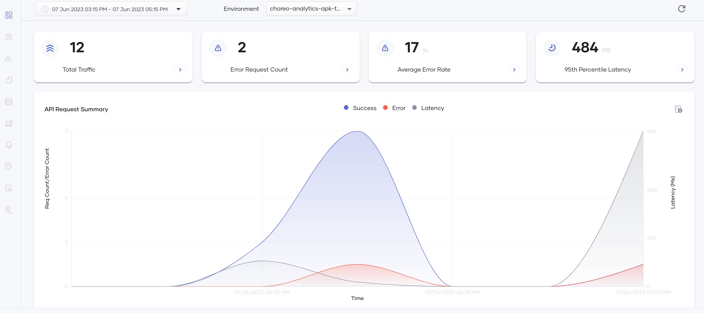
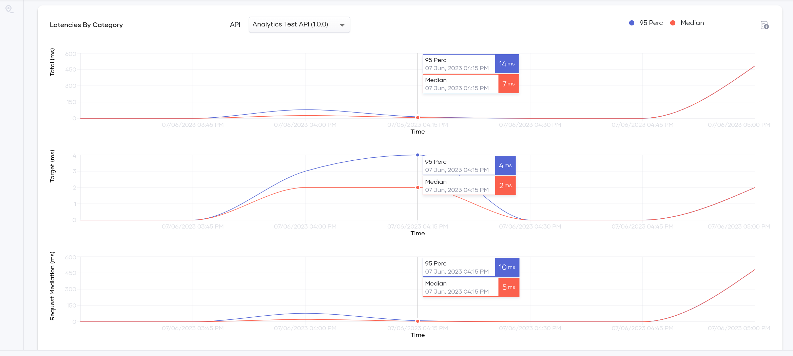

# Configure Analytics for Choreo Insights

## Step 1 - Generate On-prem Key

1. Sign in to [Choreo](https://console.choreo.dev/login/).

2. Go to `Settings > On-prem Keys` and click on `Generate Key` button.

3. Copy the generated on-prem key.


## Step 2 - Configure APK

1. Create a secret containing the Choreo Auth URL and the Choreo token using the following command. Replace the <choreo-token> will your on-prem key generated in Step 1.

=== "Sample Command"
     ```bash
     kubectl create secret generic choreo-analytics-secret --from-literal=authToken='<choreo-on-prem-key>' --from-literal=authURL='https://analytics-event-auth.choreo.dev/auth/v1' -n apk
     ```
=== "Command Format"
     ```bash
     kubectl create secret generic <secret-name> --from-literal=authToken='<choreo-on-prem-key>' --from-literal=authURL='https://analytics-event-auth.choreo.dev/auth/v1' -n <namespace>
     ```

1. Follow the instructions outlined in [Customize Configurations](../Customize-Configurations.md). These instructions will guide you through the process of acquiring the `values.yaml` file, which you will then use to tailor the analytics configurations to your specific needs. Open the `values.yaml` file. Set the following config under `wso2.apk.dp.gatewayRuntime` section and apply helm chart.

Replace <secret-name> with the name of the secret you created in the previous step.
    ```yaml
    analytics:
      enabled: true
      publishers:
      - enabled: true
        type: "default"
        secretName: <secret-name>
    ```

You can also set multiple publishers for analytics as follows.
    ```yaml
    analytics:
      enabled: true
      publishers:
        - enabled: true
          type: "default"
          secretName: <choreo-secret-name>
        - enabled: true
          type: "elk"
        - enabled: true
          type: "moesif"
          secretName: <moesif-secret-name>
    ```

## Step 3 - View Analytics Data

1. After setting up the enforcer, invoke a few requests (success and failure) for a deployed API.

2. Go to [Choreo Insights](https://console.choreo.dev/insights) and select the correct environment to view the analytics data.

Following are some of the graphs generated in the Choreo Insights.

[](../../assets/img/analytics/choreo-insights-overview.png)

[](../../assets/img/analytics/choreo-insights-latency.png)


