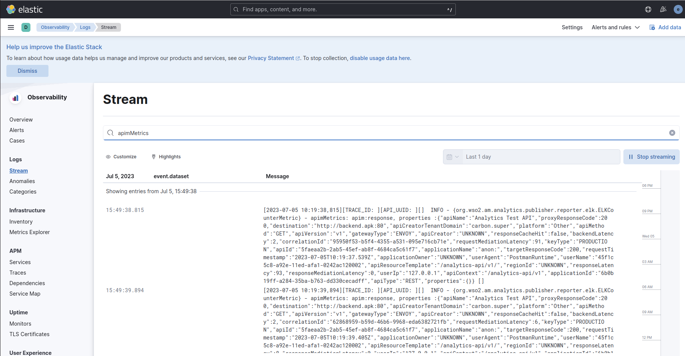

# Configure Analytics for ELK Stack

## Step 1 - Setup APK

1. Start by following the instructions outlined in [Customize Configurations](../customize-configurations.md). These instructions will guide you through the process of acquiring the `values.yaml` file.
   
2. Open the `values.yaml` file, and add the configuration given below to the `gatewayRuntime` section under `dp`. 
```yaml
analytics:
  enabled: true
  publishers:
  - enabled: true
    type: "elk"
```

Your values.yaml file should now have a structure as follows:
```yaml
wso2:
  ...
  apk:
    ...
    dp:
      ...
      gatewayRuntime:
        analytics:
          enabled: true
          publishers:
          - enabled: true
            type: "elk"
```

!!! Note
    Optionally, `logLevel` can be configured for ELK. By default, this config is set to `INFO`.

    ```yaml
      analytics:
        enabled: true
        publishers:
        - enabled: true
          type: "elk"
          logLevel: "INFO"
    ```

3. Redeploy the helm chart with the changes in `values.yaml`.

### Optional - Adding Multiple Publishers

You can also set multiple publishers for analytics as follows. Replace `choreo-secret-name` and `moesif-secret-name` with the appropriate values.

```yaml
 gatewayRuntime:
   analytics:
     enabled: true
     publishers:
       - enabled: true
         type: "default"
         secretName: <choreo-secret-name>
       - enabled: true
         type: "elk"
       - enabled: true
         type: "moesif"
         secretName: <moesif-secret-name>
```

## Step 2 - Setup Elasticsearch and Kibana

To configure Elasticsearch and Kibana on your Kubernetes cluster, you can refer to the [official guide](https://www.elastic.co/guide/en/cloud-on-k8s/current/k8s-stack-helm-chart.html) provided by Elastic. The guide includes instructions on deploying the necessary Helm charts for Elasticsearch and Kibana.

You can also install Elasticsearch and Kibana using the direct helm charts for each. The following is a sample setup that can be used to set up both. However, note that these are only for testing, and must be configured as necessary for a production environment.

### Installing Elasticsearch

1. Apply the following commands to install Elasticsearch.

```bash
helm repo add elastic https://helm.elastic.co
helm repo update
helm install elasticsearch elastic/elasticsearch
```

2. Wait for the pods to spin up. You can view them using the following command.
   
```bash
kubectl get pods
```

3. Once the pods all have spun up, you can get the elasticsearch credentials using the following command.
   
```bash
kubectl get secrets --namespace=default elasticsearch-master-credentials -ojsonpath='{.data.password}' | base64 -d
```

4. Port-forward the Elasticsearch service using the following command.
   
```bash
kubectl port-forward svc/elasticsearch-master 9200
```

### Installing Kibana

1. Apply the following commands to install Kibana.

```bash
helm install kibana elastic/kibana 
```

2. Wait for the pods to spin up. You can view them using the following command.

```bash
kubectl get pods
```

3. Port-forward the Kibana service using the following command.

```bash
kubectl port-forward deployment/kibana-kibana 5601
```

## Step 3 - Setup Logging Agent 

For forwarding Kubernetes logs to Elasticsearch, you have the option to use any logging agent that supports this functionality. Two commonly used options are Filebeat and FluentBit.

   - Filebeat: If you choose Filebeat, you can set it up in your Kubernetes environment by following the [official guide](https://www.elastic.co/guide/en/beats/filebeat/current/running-on-kubernetes.html) provided by Elastic. Filebeat is a lightweight log shipper that is part of the Elastic Stack. It can be configured to collect logs from your Kubernetes pods and forward them to Elasticsearch.

   - FluentBit: Alternatively, you can opt for FluentBit as your logging agent. FluentBit is an open-source and efficient log processor and forwarder. It is designed to work well with Kubernetes environments and can be used to collect and send logs to Elasticsearch. You can follow the [official guide](https://docs.fluentbit.io/manual/installation/kubernetes) to install FluentBit.


## Step 4 - Invoke requests and view analytics logs in Kibana UI

1. Deploy some sample APIs to APK and invoke endpoints.
   
2. Go to Kibana UI and search for logs. The UI can be accessed at `http://localhost:5601`. The password to log in can be obtained using the following command.
   
```bash
kubectl get secrets --namespace=default elasticsearch-master-credentials -ojsonpath='{.data.password}' | base64 -d
```

The default username is `elastic`.

3. Under Logs > Stream section you will be able to see a lot of logs from all the pods. To view the analytics logs search for 'apimMetrics'

[](../../assets/img/analytics/kibana-logs-view.png)

