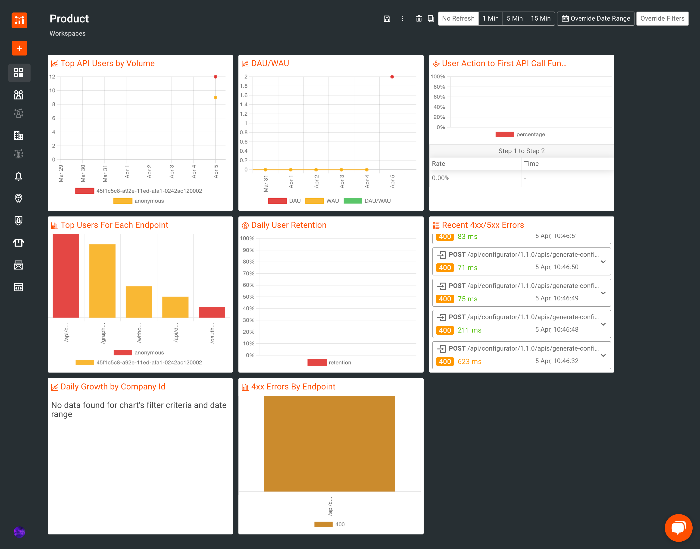

# Configure Analytics for Moesif

## Step 1 - Get Collector Application Id

1. Sign up for [Moesif](https://www.moesif.com/).

2. During the sign up process, you will receive a Collector Application Id for your configured application. Copy this value and keep it saved.

## Step 2 - Configure APK

1. Follow the instructions outlined in [Customize Configurations](../Customize-Configurations.md). These instructions will guide you through the process of acquiring the `values.yaml` file. 
2. Open the `values.yaml` file and set the following configuration under the `wso2.apk.dp.gatewayRuntime` section.

```yaml
analytics:
  enabled: true
  publishers:
  - enabled: true
    type: "moesif"
    configProperties:
      moesifToken: <collector-application-id>
```

3. Redeploy the helm chart with the changes in `values.yaml`.

### Optional - Adding Multiple Publishers

You can also set multiple publishers for analytics as follows.
```yaml
analytics:
  enabled: true
  publishers:
    - enabled: true
      configProperties:
        auth.api.token: <on-prem-key>
        auth.api.url: "https://analytics-event-auth.choreo.dev/auth/v1"
      type: "default"
    - enabled: true
      type: "elk"
    - enabled: true
      type: "moesif"
      configProperties:
        moesifToken: <collector-application-id>
```

## Step 3 - View Analytics Data

1. After setting up the enforcer, invoke a few requests (success and failure) for a deployed API.

2. Go to your Moesif dashboard and you will be able to view your analytics reports.

The following is an overview of the graphs generated in the Moesif Dashboards.

[](../../assets/img/analytics/moesif-dashboards-overview.png)


