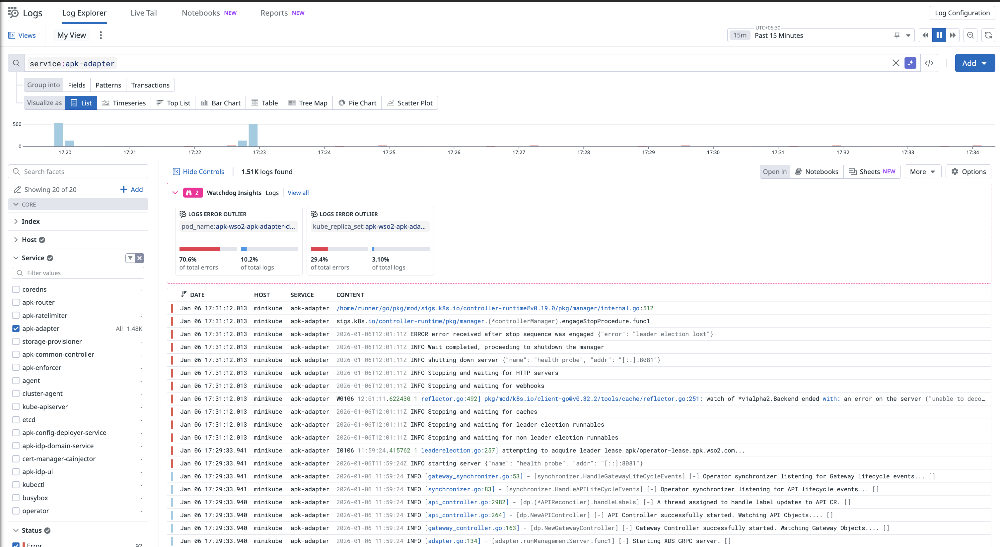

# Configure Analytics with Log Solutions

This guide demonstrates how to configure WSO2 Kubernetes Gateway to push analytics events to any log aggregation and monitoring solution such as Datadog, or other compatible platforms.

## Overview

WSO2 Kubernetes Gateway can publish analytics events as logs, which can then be collected and forwarded to your preferred log aggregation and monitoring solution. This approach provides flexibility in choosing the analytics backend that best fits your infrastructure and requirements.

Once enabled, WSO2 Kubernetes Gateway publishes analytics events to stdout as structured logs. You can then use any Kubernetes-compatible log collector to forward these logs to your chosen analytics platform.

## Step 1 - Configure WSO2 Kubernetes Gateway for Log-based Analytics

1. Start by following the instructions outlined in the <a href="../../../setup/Customize-Configurations" target="_blank">customize configurations section</a>. These instructions will guide you through the process of acquiring the `values.yaml` file.
   
2. Open the `values.yaml` file, and add the configuration given below to the `gatewayRuntime` section under `dp`. 

```yaml
analytics:
  enabled: true
  publishers:
  - enabled: true
    type: "elk"
```

Your `values.yaml` file should now have a structure as follows:

```yaml
wso2:
  ...
  apk:
    ...
    dp:
      ...
      gatewayRuntime:
        analytics:
          enabled: true
          publishers:
          - enabled: true
            type: "elk"
```

!!! Note
    The `type: "elk"` configuration enables log-based analytics output. Despite the name, this works with any log aggregation solution, not just ELK Stack. 

!!! Note
    Optionally, `logLevel` can be configured for the analytics publisher. By default, this config is set to `INFO`.

    ```yaml
      analytics:
        enabled: true
        publishers:
        - enabled: true
          type: "elk"
          logLevel: "INFO"
    ```

3. Redeploy the helm chart with the changes in `values.yaml`.

```bash
helm upgrade <release-name> <chart-path> -f values.yaml
```

### Optional - Adding Multiple Publishers

You can configure multiple publishers for analytics. Replace `choreo-secret-name` and `moesif-secret-name` with the appropriate values.

```yaml
 gatewayRuntime:
   analytics:
     enabled: true
     publishers:
       - enabled: true
         type: "default"
         secretName: <choreo-secret-name>
       - enabled: true
         type: "elk"
       - enabled: true
         type: "moesif"
         secretName: <moesif-secret-name>
```

## Step 2 - Set Up Your Log Aggregation Solution

Once WSO2 Kubernetes Gateway is configured to publish analytics events as logs, you need to set up your preferred log aggregation platform to collect and analyze these logs. WSO2 Kubernetes Gateway analytics events are compatible with any log solution that can collect logs from Kubernetes containers.

### Example: Datadog

Datadog is a popular monitoring and analytics platform that can collect and analyze WSO2 Kubernetes Gateway analytics events.

#### Prerequisites

- A Datadog account
- Datadog API key

#### Setup Guide

To set up Datadog for collecting WSO2 Kubernetes Gateway analytics:

1. Follow the [official Datadog Kubernetes setup guide](https://docs.datadoghq.com/containers/kubernetes/installation/) to install the Datadog Agent in your Kubernetes cluster.

2. Ensure that log collection is enabled in your Datadog Agent configuration. This is typically done by setting the following in your Datadog values:

```yaml
datadog:
  logs:
    enabled: true
    containerCollectAll: true
```

3. The Datadog Agent will automatically collect logs from all pods in your Kubernetes cluster, including WSO2 Kubernetes Gateway analytics events.

#### View Analytics in Datadog

1. Log in to your Datadog account at [https://app.datadoghq.com](https://app.datadoghq.com).

2. Navigate to **Logs** section. You should be able to view the logs as follows:

[](../../assets/img/analytics/datadog-logs.png)

For more information on creating dashboards and working with logs in Datadog, refer to the [Datadog Logs documentation](https://docs.datadoghq.com/logs/).

---

### Other Log Solutions

WSO2 Kubernetes Gateway analytics events can be integrated with any log aggregation solution that supports Kubernetes log collection. Common options include:

The general pattern for integration is:

1. Install a log collector agent in your Kubernetes cluster
2. Configure the collector to gather logs from WSO2 Kubernetes Gateway pods (filter by namespace or pod labels)
3. Look for logs containing `apimMetrics` in your analytics platform
4. Create visualizations and alerts based on the analytics data structure