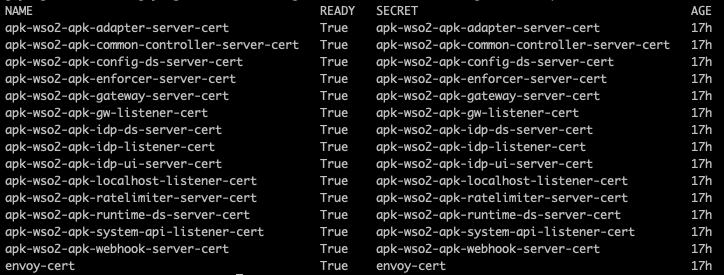

# Configuring Cert-Manager in Custom Scenarios  

In certain scenarios, you may already have **cert-manager** installed or need to install it in a different namespace. This guide outlines the steps to configure the WSO2 Kubernetes Gateway's **cert-manager** in such cases.  

When configured as described below, certificate issuance **and renewal remain fully automatic**. Your own cert-manager signs the certificates that WSO2 Kubernetes Gateway requests and renews them before they expire. No manual certificate creation or rotation is required.


## 1. Ensure Cert-Manager is Installed  

Before proceeding, ensure that your **cert-manager** is installed and running in its own namespace. You can refer to the <a href="https://cert-manager.io/docs/installation/" target="_blank">official cert-manager documentation </a> for this.

Your cert-manager installation provides the `cert-manager.io` CRDs that the certificate resources in the next steps depend on.


## 2. Create the Namespace for WSO2 Kubernetes Gateway

We will use this namespace to install WSO2 Kubernetes Gateway. For this guide, we will create a namespace named `wso2-kg`. Run the following command:  

```sh
kubectl create ns wso2-kg
```

## 3. Create an Issuer for Cert-Manager in the WSO2 Kubernetes Gateway namespace


Create an Issuer required for cert-manager by applying the following configuration:
```
apiVersion: cert-manager.io/v1
kind: Issuer
metadata:
  name: custom-issuer  
  namespace: wso2-kg 
spec:
  ca:
    secretName: apk-root-certificate
```

You can obtain the <a href="../../assets/files/cert-manager/issuer.yaml" target="_blank" download>issuer.yaml</a> file here.

!!! note
    ### Why Use an Issuer Instead of a ClusterIssuer?


    By default, WSO2 Kubernetes Gateway installation comes with a ClusterIssuer, which operates cluster-wide. However, the ClusterIssuer looks for the secret named `apk-root-certificate` in the namespace where the cert-manager is installed, whereas WSO2 Kubernetes Gateway creates the secret in its own namespace.

    There are two ways to fix this.

    1. Modify the cert-manager installation by forcing the ClusterIssuer to check the WSO2 Kubernetes Gateway namespace, as in the <a href="https://cert-manager.io/docs/configuration/#cluster-resource-namespace" target="_blank">official cert-manager documentation</a>.

   
    2. To avoid modifying cert-manager’s installation, **create an Issuer instead**, which will look for secrets in its own namespace. Then it can correctly reference the secret containing the root certificate.

    We will proceed with the **second method** in this guide.

## 4. Apply the Issuer


Run the following command to apply the issuer in the wso2-kg namespace:

=== "Command"
    ```
    kubectl apply -f issuer.yaml -n wso2-kg
    ```
=== "Format"
    ```
    kubectl apply -f <path-to-issuer.yaml-file> -n <namespace>
    ```

At this stage, if you run 
=== "Command"
    ```
    kubectl describe issuer custom-issuer -n wso2-kg
    ```
=== "Format"
    ```
    kubectl describe <issuer-name> -n <namespace>
    ```

it may show a "False" Ready status. This is expected, as the root certificate secret is not created yet. The secret will be generated when WSO2 Kubernetes Gateway is installed.


## 5. Update `values.yaml`

Modify the values.yaml file with the following configuration:
```
certmanager:
  enabled: false
  createCertificates: true
  enableClusterIssuer: false
  enableRootCa: true
  rootCaSecretName: "apk-root-certificate"
  issuerKind: "Issuer"
  listeners:
    issuerName: "custom-issuer"
    issuerKind: "Issuer"
  servers:
    issuerName: "custom-issuer"
    issuerKind: "Issuer"
```

This configuration 


- `enabled: false` — does not install the cert-manager bundled with WSO2 Kubernetes Gateway, since your own cert-manager is already running in the cluster.
- `createCertificates: true` — still creates the Certificate resources that WSO2 Kubernetes Gateway needs. Your cert-manager issues these certificates and renews them automatically before they expire.
- `enableClusterIssuer: false` — does not create the bundled ClusterIssuer, for the namespace reason described in step 3.
- `enableRootCa: true` — creates the `apk-root-certificate` secret in the WSO2 Kubernetes Gateway namespace, which is the CA your Issuer signs with.
- `issuerKind`, `listeners.issuerName` and `servers.issuerName` — point every certificate at the Issuer you created instead of a ClusterIssuer. `issuerKind` applies only to a group that also sets an `issuerName`, and the per-group value overrides the top-level `certmanager.issuerKind`, so setting it in both places as shown above is redundant but harmless.

!!! warning
    Configure **both** `listeners` and `servers`.

    With `enableClusterIssuer: false` the chart creates no issuer of its own, so each group must name one. Three certificates (the gateway, IdP and system API listeners) resolve through `listeners`; the remaining twelve resolve through `servers`. If either group is left out, the installation stops with an error that names the missing group:

    ```
    certmanager: the listeners certificates have no issuer. createCertificates is true but
    enableClusterIssuer is false, so <release-name>-selfsigned-issuer is never created.
    ```

!!! warning
    `enabled` and `createCertificates` control two different things.

    `enabled: false` only skips the installation of the bundled cert-manager. It is `createCertificates` that determines whether the chart creates the Certificate resources, and it must remain `true` here.

    Do not set `createCertificates: false` while relying on an external cert-manager. No Certificate resources would be created, so nothing would ever request issuance or renewal, and the gateway's certificates would eventually expire and cause pods to fail to start. Setting it to `false` means you take responsibility for supplying and rotating every `*-cert` secret yourself.

!!! note
    This guide requires a chart version that supports `certmanager.createCertificates`.

    In earlier 1.3.0 chart versions, `certmanager.enabled: false` also suppressed the Certificate resources. Certificates were therefore never renewed and expired at the end of their original validity period. If `kubectl get certificates` returns no resources after installing, you are on an affected version and should upgrade.

## 6. Install APK

Now, install WSO2 Kubernetes Gateway using Helm with the modified values.yaml file.

=== "Command"
    ```
    helm install apk wso2apk/apk-helm --version 1.3.0 -f values.yaml -n wso2-kg
    ```
=== "Format"
    ```
    helm install <chart-name> <repository-name>/apk-helm --version <version-of-WSO2-Kubernetes-Gateway> -f <path-to-values.yaml-file> -n <namespace>
    ```

## 7. Verify the Certificate Status

Once WSO2 Kubernetes Gateway is installed, check the certificates by running:
=== "Command"
    ```
    kubectl get certificates -n wso2-kg
    ```
=== "Format"
    ```
    kubectl get certificates -n <namespace>
    ```

You should be able to see them having transitioned to the Ready status as follows.

[](../assets/img/cert-manager/certificates.png)

!!! note
    If this command reports `No resources found`, the Certificate resources were not created. Check that `certmanager.createCertificates` is set to `true` in your values.yaml, then run `helm upgrade` with the corrected file.

Cert-manager renews these certificates automatically. You can confirm the current validity period of any certificate with:

=== "Command"
    ```
    kubectl get certificate apk-wso2-apk-adapter-server-cert -n wso2-kg -o jsonpath='{.status.notAfter}'
    ```
=== "Format"
    ```
    kubectl get certificate <certificate-name> -n <namespace> -o jsonpath='{.status.notAfter}'
    ```
