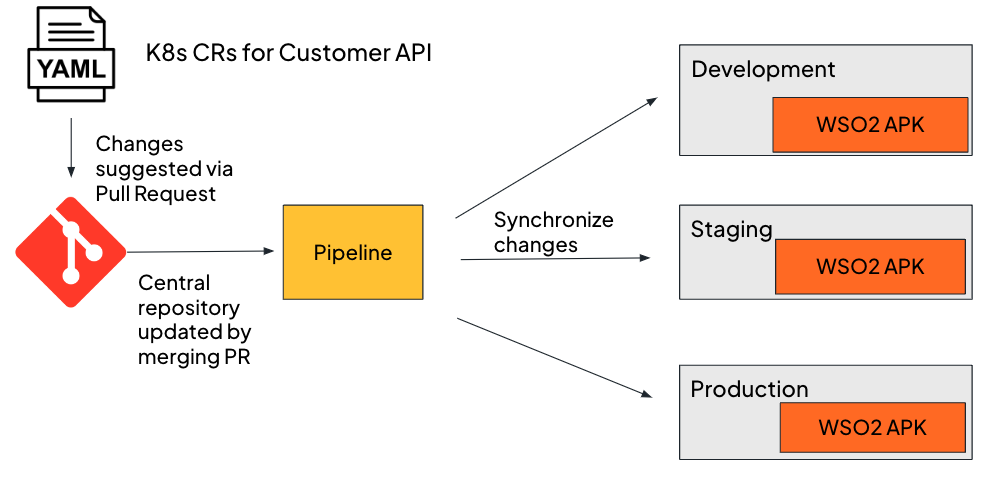
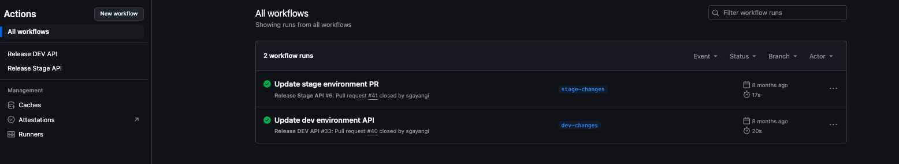

### Example Scenario

1. Imagine you have created a Customer API, which is used to manage the information of your organization’s customers. 
The organization requires that the API be in two environments: development and staging, to ensure that the API functions properly. 
2. However, the APIs across the environments are not identical - there are changes specific to each environment. Additionally, each of these APIs may be constantly updated and changed in the future.
3. If you try to manually deploy the API, each update to customerAPI would need to be manually tracked and deployed across your environments. This process is prone to human error, and can lead to inconsistencies that can result in the API behaving unexpectedly in different environments.

Now, let's reimagine the previous scenario with the WSO2 APK and CI/CD.

[](../../assets/img/cicd/cicd-process.png)

1. The code and configurations of the customer API will be stored in a Git repository. 
2. You can suggest changes to the configurations or the code stored in the Git repository using a pull request.
3. You can also maintain different branches for different environments with their own unique configurations for each environment.
4. Once a PR with the new commits has been approved and merged, you can configure a workflow that automatically runs to seamlessly integrate these changes across your environments.

### Practical Guide
- This example provides a practical setup guide for a GitOps pipeline to automate the deployment of the above mentioned Customer API.
- APK will be installed in two namespaces - `apk-dev` and `apk-stage`, which serve as the two environments for the organization.
- The primary API configuration files will be in the main branch of the Github repository.
- There will be two Git branches - the `dev` and `stage` branches. Each branch corresponds to an environment. 
- The pipeline will automatically update the deployed API when changes are merged into the relevant Git branches (dev or stage), ensuring that environment-specific properties are correctly applied.

Reference repository: <a href="https://github.com/sgayangi/APKGitOpsDemo" target="_blank">https://github.com/sgayangi/APKGitOpsDemo</a>

#### Step 1 - Setting up the environment

1. Set up a Kubernetes cluster - For this setup, your Github repository needs to be able to access your Kubernetes cluster, so your cluster needs to be publicly accessible. You can set up such a cluster on <a href="https://cloud.google.com/kubernetes-engine/docs/how-to/creating-a-zonal-cluster" target="_blank">Google Cloud Platform</a>, <a href="https://docs.aws.amazon.com/eks/latest/userguide/create-cluster.html" target="_blank">AWS</a> or <a href="https://learn.microsoft.com/en-us/azure/aks/learn/quick-kubernetes-deploy-portal?tabs=azure-cli" target="_blank">Azure</a>. When setting Kubernetes versions and resource limits, <a href="https://apk.docs.wso2.com/en/latest/setup/prerequisites/" target="_blank"> ensure that they are supported by APK.</a>
2. Create the namespaces - In your cluster, we will create two namespaces corresponding to the two environments: `apk-dev` and `apk-stage`.
3. Create your Github repository - This repository will contain 3 branches; main, dev and stage.
After creating the cluster, retrieve the KUBE_CONFIG credentials and add it to your Github repository secrets to allow it to access the cluster. (<a href="https://docs.aws.amazon.com/eks/latest/userguide/create-kubeconfig.html" target="_blank">AWS</a>, <a href="https://learn.microsoft.com/en-us/azure/aks/control-kubeconfig-access" target="_blank">Azure</a>, <a href="https://cloud.google.com/kubernetes-engine/docs/how-to/cluster-access-for-kubectl" target="_blank">GCP</a>)

#### Step 2 - Install APK to both namespaces in the cluster

You can install APK for a given namespace by running the following commands.

```
helm repo add wso2apk https://github.com/wso2/apk/releases/download/1.2.0
helm repo update
helm install apk-dev wso2apk/apk-helm --version 1.2.0 -n apk-dev
helm install apk-stage wso2apk/apk-helm --version 1.2.0 -n apk-stage
```

You can also modify your APK installation using the instructions given in <a href="https://apk.docs.wso2.com/en/latest/setup/Customize-Configurations/" target="_blank">https://apk.docs.wso2.com/en/latest/setup/Customize-Configurations/</a>

#### Step 3 -  Update /etc/hosts file

Add the following entries to the /etc/hosts file of the cluster.

Dev environment:
```
kubectl get svc apk-dev-wso2-apk-gateway-service -n apk-dev
sudo echo "EXTERNAL-IP dev.gw.wso2.com" >> /etc/hosts
sudo echo "EXTERNAL-IP api.am.wso2.com" >> /etc/hosts
sudo echo "EXTERNAL-IP idp.am.wso2.com" >> /etc/hosts
```

Stage environment: 
```
kubectl get svc apk-stage-wso2-apk-gateway-service -n apk-stage
sudo echo "EXTERNAL-IP stage.gw.wso2.com" >> /etc/hosts
```

#### Step 4 - Generate your Kubernetes yaml files for the Customer API

You can create your Kubernetes CRs using the following guide: <a href="https://apk.docs.wso2.com/en/latest/create-api/create-and-deploy-apis/rest/create-rest-api-using-rest-api/" target="_blank">https://apk.docs.wso2.com/en/latest/create-api/create-and-deploy-apis/rest/create-rest-api-using-rest-api/</a>

You can also generate the yaml files using an apk-conf file and the corresponding API definition file, as described [here](../../api-management-overview/tools-for-api-development.md#option-2---generate-k8s-custom-resources-using-config-generator-tool-and-deploy-the-api-using-kubernetes-client)

Once you have your yaml files, you can commit them to the main branch, as in the <a href="https://github.com/sgayangi/APKGitOpsDemo" target="_blank">reference repository.</a>

#### Step 5 - Deploy the Customer API in the dev and stage environments

Then, to the dev and stage branches, have a PR each that does a change to the API specific to the dev and stage environments. For example, in the main branch, if your HTTPRoute is

```
apiVersion: "gateway.networking.k8s.io/v1beta1"
kind: "HTTPRoute"
metadata:
  name: "customer-production-httproute-1"
spec:
  hostnames:
    - "default.gw.wso2.com"
  rules:
    - matches:
        - path:
            type: "RegularExpression"
            value: "/customers"
          method: "GET"
      backendRefs:
        - group: "dp.wso2.com"
          kind: "Backend"
          name: "backend-customer-api"
  parentRefs:
    - group: "gateway.networking.k8s.io"
      kind: "Gateway"
      name: "default"
      sectionName: "httpslistener"
```

Then for your dev branch, the PR can do the following change to the HTTPRoute file
```
apiVersion: "gateway.networking.k8s.io/v1beta1"
kind: "HTTPRoute"
metadata:
  name: "customer-production-httproute-1"
spec:
  hostnames:
    - "dev.gw.wso2.com"
```

Therefore in the dev environment, your invocations should go to the hostname “dev.gw.wso2.com” instead of “default.gw.wso2.com” when this PR is merged.

!!! note
    The workflow file we will develop later is used to automatically deploy the API in the main branch, and add the changes in the dev or stage branches whenever a PR is merged to the dev or stage branch. Note that **this is only an example scenario**, and the workflow can be modified to accomodate other scenarios, as described in step .

#### Step 6 - Deploy the backends for your Customer API

You can use the following commands to deploy the backends for the Customer API.

```
kubectl create ns backend-dev backend-stage
kubectl apply -f https://raw.githubusercontent.com/sgayangi/APKGitOpsDemo/refs/heads/main/backend/dev-backend.yaml -n backend-dev
kubectl apply -f https://raw.githubusercontent.com/sgayangi/APKGitOpsDemo/refs/heads/main/backend/stage-backend.yaml -n backend-stage
```

The endpoints for the backends would then be:

- Dev: http://backendservice.backend-dev.svc.cluster.local:9090
- Stage: http://backendservice.backend-stage.svc.cluster.local:9090

[Create Backend CR](../../create-api/create-and-deploy-apis/rest/create-rest-api-using-crs.md#create-backend-cr) describes how to get the URL of a backend deployed on a cluster.

!!! note
    The backends in the files provided use a custom Docker image that was pre-built. Feel free to use a test URL like [https://httpbin.org/anything](https://httpbin.org/anything) or another Docker image.

#### Step 7 - Set up the Github workflow files

This <a href="https://docs.github.com/en/actions/writing-workflows/quickstart" target="_blank">website</a> can give you a quickstart into writing your own Github workflow file.

You can also view the sample workflow file at <a href="https://github.com/sgayangi/APKGitOpsDemo/blob/dev/.github/workflows/dev-release.yaml" target="_blank">[website](https://github.com/sgayangi/APKGitOpsDemo/blob/dev/.github/workflows/dev-release.yaml)</a> and <a href="https://github.com/sgayangi/APKGitOpsDemo/blob/stage/.github/workflows/stage-release.yaml" target="_blank">[website](https://github.com/sgayangi/APKGitOpsDemo/blob/stage/.github/workflows/stage-release.yaml)</a>

#### Step 8 - Trigger the workflow

Merge the PRs you created for the dev and stage branches, so that the workflow files will run automatically. You can view the status in the Actions tab.

[](../../assets/img/cicd/workflows.png)

#### Step 9 - Invoke the Customer APIs

You can invoke the APIs using the following commands.

Dev:
```
curl --location 'https://dev.gw.wso2.com:9095/customers/1.0.0/customers' \
--header 'Authorization: Bearer <accessToken>'
```

Stage:

```
curl --location 'https://stage.gw.wso2.com:9095/customers/1.0.0/customers' \
--header 'Authorization: Bearer <accessToken>'
```
