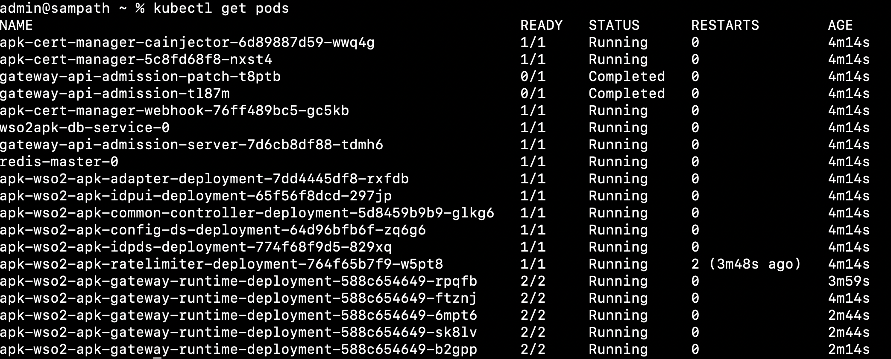

# Configure Horizontal Pod Autoscaling(HPA) for gateway

When the traffic to your pods increase, the deployment may need to scale horizontally. Kubernetes allows you to define the resource limits and policy in a way that the deployment can auto scale based on resource usage. You can check the [Kubernetes documentation](https://kubernetes.io/docs/tasks/run-application/horizontal-pod-autoscale/) for more information on HPA.

To configure HPA for gateway, update the `values.yaml`'s `wso2.apk.dp.gateway.autoscaling` section with the following values. Instructions in [Customize Configurations](../setup/Customize-Configurations.md) will guide you through the process of acquiring the `values.yaml` file.

```yaml
        autoscaling:
          enabled: true
          minReplicas: 1
          maxReplicas: 5
          targetMemory: 80
          targetCPU: 80
``` 

This will enable the HPA for gateway and set the minimum and maximum number of replicas to 1 and 5 respectively. The target memory and CPU usage are set to 80% each.

Sample APK deployment with HPA enabled for gateway-runtime-deployment will be as follows.

[](../assets/img/setup/hpa-deployment.png)