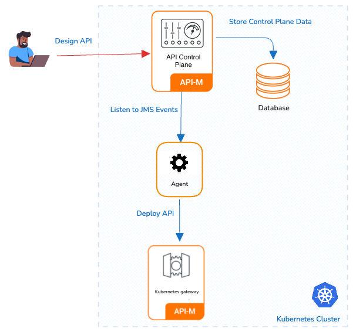

### Overview

In this approach, both the Kubernetes Gateway and the APIM Control Plane are in a Kubernetes cluster. 

#### Advantages

* Resource Efficiency: This pattern maximizes resource utilization by allowing multiple components to coexist within the same cluster.
* Simplified Management: Managing a single cluster with multiple namespaces can be more straightforward compared to managing separate clusters.

#### Considerations

* Isolation: While namespaces provide a level of isolation, they may not offer the same level of isolation as separate clusters. Careful resource allocation and RBAC (Role-Based Access Control) policies are essential.
* APIM in K8s: Running the APIM in a Kubernetes cluster may require additional resources and configurations compared to running it in a VM.

### Installation Guideline
 

{!control-plane/apk-as-gateway-in-apim/start-apk-cp-to-dp-k8s.md!}

Login to the Publisher Console (<a href="https://am.wso2.com/publisher" target="_blank">https://am.wso2.com/publisher</a>) of the WSO2 API Manager.
