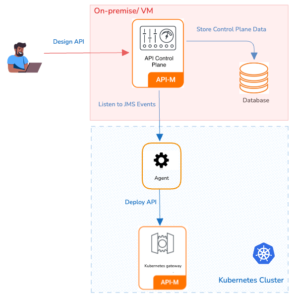

### Overview

In this approach, the APK Data Plane is deployed in a Kubernetes cluster, and the APIM is in a Virtual Machine. In this pattern, the APK Data Plane will have visibility over all namespaces (or a predefined set of namespaces) in the cluster

#### Advantages

* Isolation: The APK Data Plane operates in its own dedicated Kubernetes cluster, while the APIM CP resides in a VM, providing the highest level of isolation and minimizing the risk of interference between components.
* Security: With a separate cluster and VM setup, it's easier to implement stringent security policies specific to each component.
* Performance Predictability: Resources are exclusively allocated to each component's infrastructure, guaranteeing consistent performance levels.

#### Considerations

* Resource Utilization: This approach may require additional resources due to the need for separate cluster and VM for each environment.
* Administrative Overhead: Managing multiple cluster and VMs can be more complex and may require additional administrative effort.

### Installation Guideline

By default, the WSO2 APK is configured to support the Data Plane Only Pattern. You can follow the steps below to perform the deployment using this pattern.

{!control-plane/apk-as-gateway-in-apim/start-apk-cp-to-dp-vms.md!}

This approach is recommended for all Production, Dev, Test, and UAT environments. Here, a separate Kubernetes cluster and a VM server are required for each environment.
