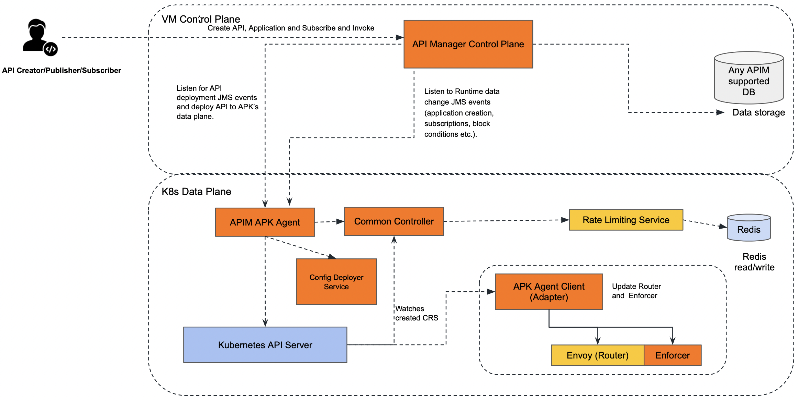

# APK as Gateway in APIM Deployment Patterns

This document outlines the recommended deployment patterns for the WSO2 APK as Gateway in WSO2 API Manager. There are two primary deployment patterns for WSO2 APK as Gateway in WSO2 API Manager.

* [Data Plane and Control Plane both in Kubernetes cluster](#data-plane-and-control-plane-both-in-kubernetes-cluster)
* [Data Plane in Kubernetes cluster and Control Plane in a VM](#data-plane-in-kubernetes-cluster-and-control-plane-in-a-vm)

## Data Plane and Control Plane both in Kubernetes cluster

### Overview

In this approach, both APK Dataplane and APIM are in a single kubernetes cluster. In this pattern APK dataplane will have visibility over all the namespace (or a predefined set of namespaces) in the cluster.

### Architecture diagram

### Advantages

* Resource Efficiency: This pattern maximizes resource utilization by allowing multiple components to coexist within the same cluster.
* Simplified Management: Managing a single cluster with multiple namespaces can be more straightforward compared to managing separate clusters.

### Considerations

* Isolation: While namespaces provide a level of isolation, they may not offer the same level of isolation as separate clusters. Careful resource allocation and RBAC (Role-Based Access Control) policies are essential.
* APIM in K8s: Running APIM in a Kubernetes cluster may require additional resources and configurations compared to running it in a VM.

### Deployment guideline

By default, WSO2 APK is configured to support the Data Plane Only Pattern. You can follow the below steps to do the deployment using this pattern. 

{!control-plane/apk-as-gateway-in-apim/start-apk-cp-to-dp-k8s.md!}

This approach is recommended for all Production, Dev, Test, and UAT environments. Here a seperate kubernetes cluster is required for each environment.

## Data Plane in Kubernetes cluster and Control Plane in a VM

### Overview

In this approach, APK Dataplane is deployed in a kubernetes cluster and APIM in Virtual Machine. In this pattern APK dataplane will have visibility over all the namespace (or a predefined set of namespaces) in the cluster.

### Architecture diagram

### Advantages

* Isolation: APK Dataplane operates in its own dedicated kubernetes cluster, while APIM CP in a VM, providing the highest level of isolation and minimizing the risk of interference between components.
* Security: With separate cluster and VM setup it's easier to implement stringent security policies specific to each component.
* Performance Predictability: Resources are exclusively allocated to each cluster, guaranteeing consistent performance levels.

### Considerations

* Resource Utilization: This approach may require additional resources due to the need for separate cluster and VM for each environment.
* Administrative Overhead: Managing multiple cluster and VMs can be more complex and may require additional administrative effort.

### Deployment guideline

By default, WSO2 APK is configured to support the Data Plane Only Pattern. You can follow the below steps to do the deployment using this pattern.

{!control-plane/apk-as-gateway-in-apim/start-apk-cp-to-dp-vms.md!}

This approach is recommended for all Production, Dev, Test, and UAT environments. Here a seperate kubernetes cluster and a VM server is required for each environment.
