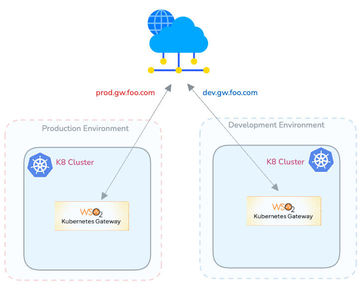

### Overview

In this approach, each environment (dev, prod, etc..) has its own dedicated Kubernetes cluster hosting an instance of the Kubernetes Gateway. In this pattern Kubernetes Gateway will have visibility over all the namespace (or a predefined set of namespaces) in the cluster.


[](../../assets/img/deployment-patterns/APK_Dataplane_per_Cluster.png)

#### Advantages

* Isolation: Each environment operates in its own dedicated cluster, providing the highest level of isolation and minimizing the risk of interference between environments.
* Security: With separate clusters, it's easier to implement stringent security policies specific to each environment.
* Performance Predictability: Resources are exclusively allocated to each cluster, guaranteeing consistent performance levels.

#### Considerations

* Resource Utilization: This approach may require additional resources due to the need for separate clusters for each environment.
* Administrative Overhead: Managing multiple clusters can be more complex and may require additional administrative effort.


### Installation guideline

#### Section 1: Add Kubernetes Gateway Helm Repository

!!!note
    If you’d like to use the commercial Docker images and Helm chart, please use the <a href="../../enterprise-apk-install" target="_blank">Helm Repository with Commercial Docker Images</a> and skip this section.

Adding the Kubernetes Gateway Helm repository allows your system to fetch and install the latest Kubernetes Gateway components from the remote repository. This ensures that you are always using the most up-to-date version of Kubernetes Gateway.

```console
helm repo add wso2apk https://github.com/wso2/apk/releases/download/1.3.0

helm repo update
```

#### Section 2: Install Kubernetes Gateway Components

!!!note
    If you followed the commercial Docker images section, please use <b>wso2</b> as the <b>repository name</b> instead of <b>wso2apk</b> from now on. 
    Make sure you have applied all require changes to `values yaml` as mention in  <a href="../../enterprise-apk-install" target="_blank">Helm Repository with Commercial Docker Images</a> before proceed with helm installation.

Next, install the Kubernetes Gateway components to set up the necessary infrastructure to manage and deploy APIs within your Kubernetes cluster.

Install the Kubernetes Gateway components and start the WSO2 API Platform For Kubernetes. Consider <b>apk</b> as the <b><chart-name\></b> for this guide. 
Use the version of the release you added in Step.

1. **Download `values.yaml` File**

    To obtain the `values.yaml` file, you can use the `helm show values` command. Replace `<repository-name>` with the actual repository name and `<version-of-APK>` with the desired version of the Kubernetes Gateway. Run the following command:

    === "Command"
        ```
        helm show values wso2apk/apk-helm --version 1.3.0  > values.yaml
        ```

    === "Format"
        ```
        helm show values <repository-name>/apk-helm --version <version-of-APK> > values.yaml
        ```

 

2. **Install Helm Chart** 
    Most production deployments require you to customize the values.yaml file. If you have no custom changes, you can use the default configuration as-is.
    To begin the installation, run the following command. 

    === "Command"
        ```
        helm install apk wso2apk/apk-helm --version 1.3.0 -f values.yaml
        ```
    === "Format"
        ```
        helm install <chart-name> <repository-name>/apk-helm --version <version-of-APK> -f <path-to-values.yaml-file> 
        ```

!!!Optional
    If you want to update an existing Kubernetes Gateway installation, use the following Helm upgrade command. The --no-hooks flag disables the hooks available in the Kubernetes Gateway Helm chart.

    === "Command"
        ```
        helm upgrade apk wso2apk/apk-helm --version 1.3.0 -f values.yaml --no-hooks
        ```
    === "Format"
        ```
        helm upgrade <chart-name> <repository-name>/apk-helm --version <version-of-APK> -f <path-to-values.yaml-file> --no-hooks
        ```

#### Verify the deployment

Verifying the deployment confirms that all Kubernetes Gateway components are successfully installed and running as expected. If any issues arise, troubleshooting them at this stage ensures a smooth API deployment process.
Check the status of deployed pods:

=== "Command"
    ```
    kubectl get pods
    ```

    [](../../assets/img/get-started/podstatus.png)

    !!! Important
        Except for the `gateway-apim-admission` and `gateway-apim-admission-patch` (which will run as soon as Kubernetes Gateway is installed and then complete), all other pods should transition to the running state. If they have not, please refer the <a href="../../about-apk/FAQs/#4-why-are-pods-not-transitioning-to-the-running-state-for-a-long-time" target="_blank">FAQs</a> to troubleshoot the problem.
