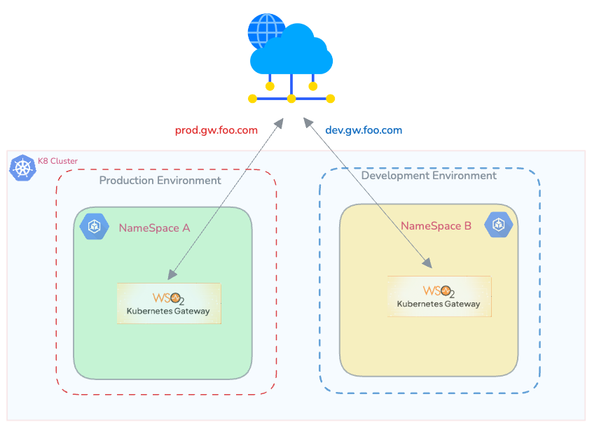

### Overview

In this approach, multiple environments (dev, prod, etc..) share the same Kubernetes cluster. Each environment has its own dedicated namespace containing the APK dataplane.


[](../../assets/img/deployment-patterns/APK_Dataplane_per_NS.png)

### Advantages

* Resource Efficiency: This pattern maximizes resource utilization by allowing multiple environments to coexist within the same cluster.
* Simplified Management: Managing a single cluster with multiple namespaces can be more straightforward compared to managing separate clusters.

### Considerations
* Isolation: While namespaces provide a level of isolation, they may not offer the same level of isolation as separate clusters. Careful resource allocation and RBAC (Role-Based Access Control) policies are essential.

### Installation guideline

!!!note
    If you’d like to use the commercial Docker images and Helm chart, please use the <a href="../../enterprise-apk-install" target="_blank">Helm Repository with Commercial Docker Images</a> and skip this section.

Inorder to deploy APK as Dataplane per namespace pattern you need to change some values.yaml file configurations. Let’s say you want to deploy APK for Dev environment and you need to deploy it on namespace named `development` then update the values.yaml file as follows

```yaml
Wso2:
  apk:
    dp:
      adapter:
        configs:
          apiNamespaces:
          - "development"
      commonController:
        configs:
          apiNamespaces:
          - "development"
```

You need to change the default hostname and vhost. Change the following values.yaml configurations. Lets say you want to deploy a development environment and you have a domain name example.com and you want to expose your API's through dev.gw.example.com and expose APK system APIs through dev.apk.example.com then

- wso2.apk.listener.hostname: 'dev.apk.example.com'
- wso2.apk.dp.gateway.listener.hostname: 'dev.gw.example.com'
- wso2.apk.dp.configdeployer.vhosts: [{"hosts":["gw.example.com"],"name":"dev","type":"production"}]


This approach is recommended for maintaining Dev, Test environments. 
