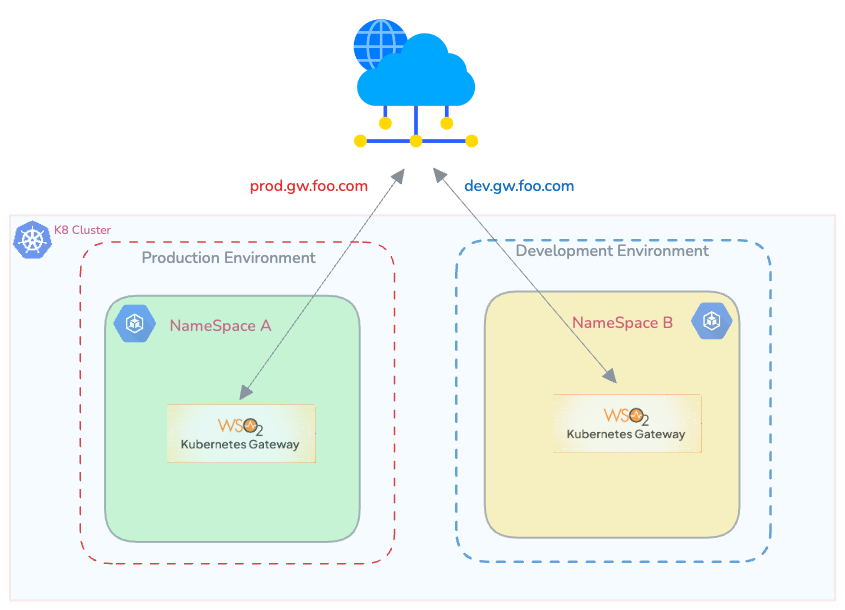
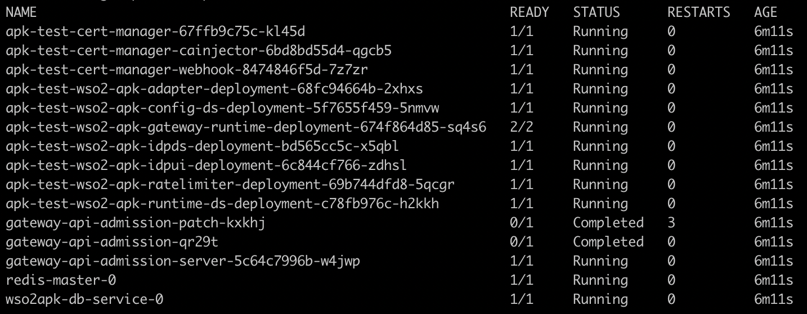

### Overview

In this approach, multiple environments (dev, prod, etc.) share the same Kubernetes cluster. Each environment has its own dedicated namespace containing the Kubernetes Gateway dataplane.


[](../../assets/img/deployment-patterns/APK_Dataplane_per_NS.png)

### Advantages

* Resource Efficiency: This pattern maximizes resource utilization by allowing multiple environments to coexist within the same cluster.
* Simplified Management: Managing a single cluster with multiple namespaces can be more straightforward compared to managing separate clusters.

### Considerations
* Isolation: While namespaces provide a level of isolation, they may not offer the same level of isolation as separate clusters. You don't need cluster-wide permissions to add this option.

### Installation Guideline


!!! note
    Deploying the multi gateway at the cluster must be done using the updated `1.3.0-1` helm-chart which can be obtained from [this link](https://artifacthub.io/packages/helm/wso2/apk-helm/1.3.0-1). Additionally, the relevant enterprise images must be used for the installation as shown in the following link for [Enterprise Installation Instructions](https://apk.docs.wso2.com/en/latest/setup/enterprise-apk-install/).

#### Create a namespace for your Kubernetes Gateway installation.
```bash
kubectl create namespace apk
```

#### Install CRD to the Cluster

Download the Custom Resource Definitions (CRDs) file from [this link](../../assets/files/configure-permissions/crds.yaml) and install it in your Kubernetes cluster using the following command:
```bash
kubectl apply -f crds.yaml
```

#### Section 1: Add Kubernetes Gateway Helm Repository

Adding the Kubernetes Gateway Helm repository allows your system to fetch and install the latest Kubernetes Gateway components from the remote repository. This ensures that you are always using the most up-to-date version of Kubernetes Gateway.

```console
helm repo add wso2 https://helm.wso2.com

helm repo update
```

#### Section 2: Install Kubernetes Gateway Components


1. Download the `values.yaml` file

    To obtain the `values.yaml` file, you can use the `helm show values` command. Replace `<repository-name>` with the actual repository name and `<version-of-APK>` with the desired version of the Kubernetes Gateway. Run the following command:

    === "Command"
        ```
        helm show values wso2/apk-helm --version 1.3.0-1  > values.yaml
        ```

    === "Format"
        ```
        helm show values <repository-name>/apk-helm --version <version-of-APK> > values.yaml
        ```

2. Add the following key to the `values.yaml` file to skip the default installation of CRDs.
```yaml
skipCrds: true
```

3. Change the `values.yaml` file by adding the following configurations for `resourceLevelPermissions` and disabling ClusterRole creation.
```yaml
wso2:
  apk:
    auth:
      enabled: true
      enableServiceAccountCreation: true
      enableClusterRoleCreation: false
      serviceAccountName: wso2apk-platform
      resourceLevelPermissions: 
        scope: Namespaced
        roleName: wso2apk-role
```

4. By default, the helm installation creates a Service Account, Role, and RoleBinding for the Kubernetes Gateway components only within the namespace in which you install it. Optionally you may add other namespaces as desired to the `apiNamespaces` in the `values.yaml` file under the `adapter` and `commonController` sections. This will allow the Kubernetes Gateway to manage APIs in those namespaces as well. However, you will need to create additional Roles and RoleBindings for those namespaces as well.
```yaml
adapter:
  deployment:
    configs: 
      apiNamespaces:
        - "apk-v12"
---          
commonController:
  deployment:
    configs:
      apiNamespaces:
        - "apk-v12"
```

5. Disable the ClusterRole and ClusterRoleBinding that are created by default to support the Kubernetes Gateway API admission webhook server. This can be done by modifying the `values.yaml` file as follows: 
```yaml
gatewaySystem:
  enabled: false # Disables the Gateway API admission webhook server 
```

6. Install Helm Chart 

    Most production deployments require you to customize the  `values.yaml` file. If you have no custom changes, you can use the default configuration as-is.
    To begin the installation, run the following command. 

    === "Command"
        ```
        helm install apk wso2/apk-helm --version 1.3.0-1 -f values.yaml --skip-crds
        ```
    === "Format"
        ```
        helm install <chart-name> <repository-name>/apk-helm --version <version-of-APK> -f <path-to-values.yaml-file>  --skip-crds
        ```

7. If you wish to deploy the Kubernetes Gateway in another namespace, you can follow the same steps starting from section 2.


#### Verify the deployment

Verifying the deployment confirms that all Kubernetes Gateway components are successfully installed and running as expected. If any issues arise, troubleshooting them at this stage ensures a smooth API deployment process.
Check the status of deployed pods:

=== "Command"
    ```
    kubectl get pods -n apk
    ```

    [](../../assets/img/get-started/podstatus.png)

    !!! Important
        Except for the `gateway-apim-admission` and `gateway-apim-admission-patch` (which will run as soon as Kubernetes Gateway is installed and then complete), all other pods should transition to the running state. If they have not, please refer to the <a href="../../about-apk/FAQs/#4-why-are-pods-not-transitioning-to-the-running-state-for-a-long-time" target="_blank">FAQs</a> to troubleshoot the problem.


