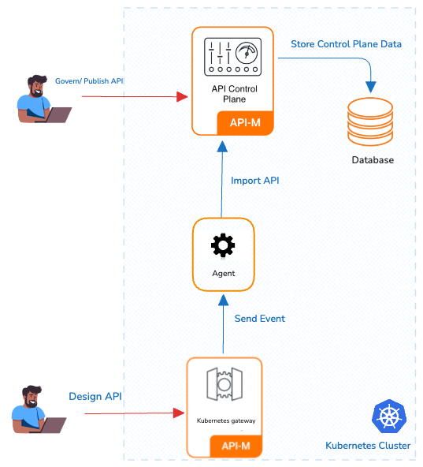

### Overview

In this approach, both APK Dataplane and APIM are in a single kubernetes cluster. In this pattern APK dataplane will have visibility over all the namespace (or a predefined set of namespaces) in the cluster.

### Advantages

* Resource Efficiency: This pattern maximizes resource utilization by allowing multiple components to coexist within the same cluster.
* Simplified Management: Managing a single cluster with multiple namespaces can be more straightforward compared to managing separate clusters.

### Considerations

* Isolation: While namespaces provide a level of isolation, they may not offer the same level of isolation as separate clusters. Careful resource allocation and RBAC (Role-Based Access Control) policies are essential.
* APIM in K8s: Running APIM in a Kubernetes cluster may require additional resources and configurations compared to running it in a VM.

### Deployment guideline

By default, WSO2 APK is configured to support the Data Plane Only Pattern. You can follow the below steps to do the deployment using this pattern.

{!control-plane/start-apk-dp-to-cp-k8s.md!}

This approach is recommended for all Production, Dev, Test, and UAT environments. Here a seperate kubernetes cluster is required for each environment.