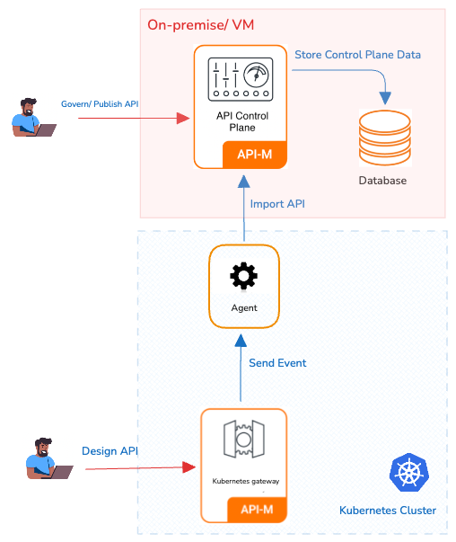

### Overview

In this approach, APK Dataplane is deployed in a kubernetes cluster and APIM in Virtual Machine. In this pattern APK dataplane will have visibility over all the namespace (or a predefined set of namespaces) in the cluster.

### Architecture diagram

### Advantages

* Isolation: APK Dataplane operates in its own dedicated kubernetes cluster, while APIM CP in a VM, providing the highest level of isolation and minimizing the risk of interference between components.
* Security: With separate cluster and VM setup it's easier to implement stringent security policies specific to each component.
* Performance Predictability: Resources are exclusively allocated to each cluster, guaranteeing consistent performance levels.

### Considerations

* Resource Utilization: This approach may require additional resources due to the need for separate cluster and VM for each environment.
* Administrative Overhead: Managing multiple cluster and VMs can be more complex and may require additional administrative effort.

### Deployment guideline

By default, WSO2 APK is configured to support the Data Plane Only Pattern. You can follow the below steps to do the deployment using this pattern.

{!control-plane/start-apk-dp-to-cp-vms.md!}

This approach is recommended for all Production, Dev, Test, and UAT environments. Here a seperate kubernetes cluster and a VM server is required for each environment.
