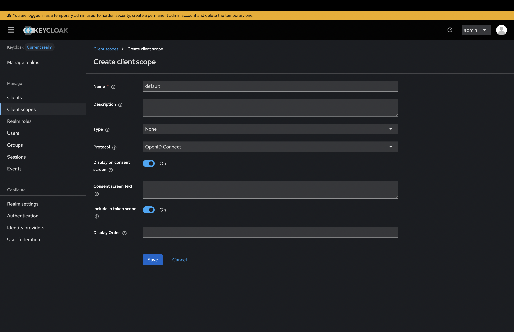
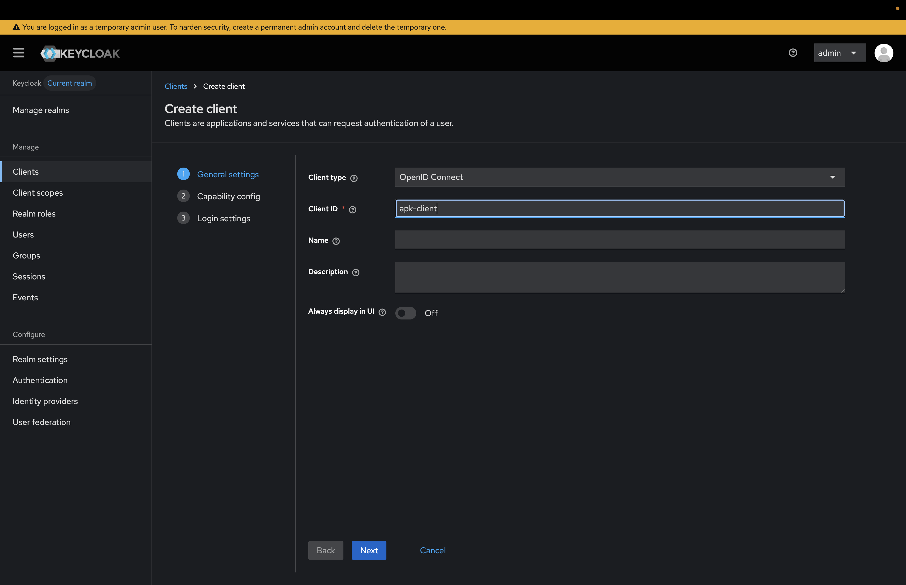
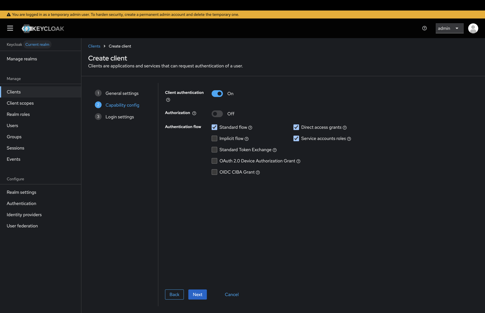
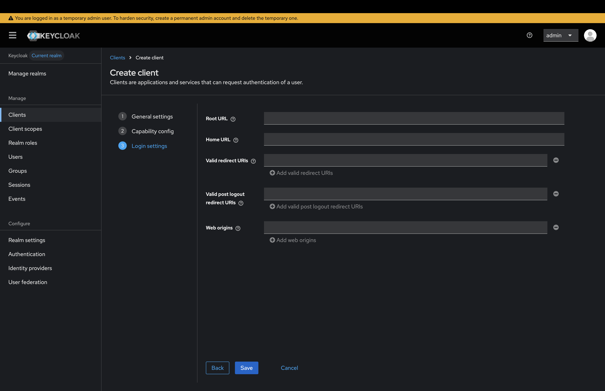
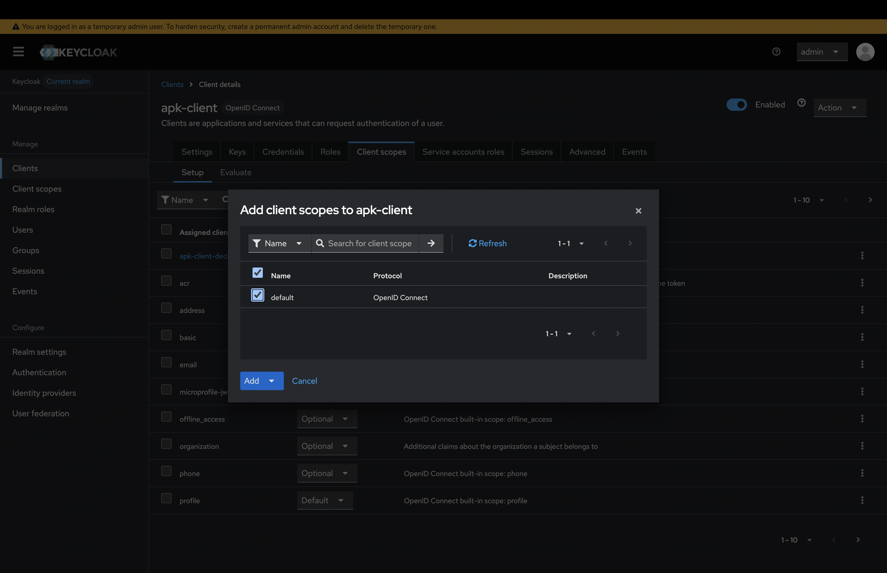
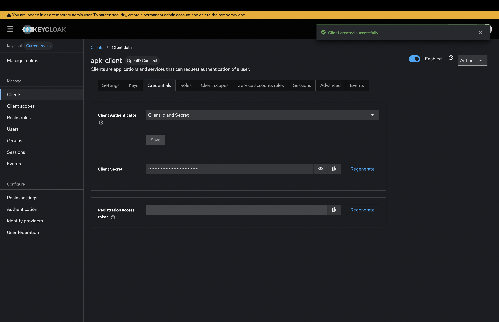

# Using Keycloak as an IdP

Follow the instructions below to use Keycloak as the Identity Provider (IdP) to authenticate the APIs that belong to a specific Organization:

# Configure Keycloak

1. Sign in to the Keycloak Management Console.

2. Click Client Scopes and create client scope named "default".

    [](../../../assets/img/keyclock/client-scope.png)

3. Click Clients and create client

    Add client id - In this scenario it is "apk-client"

    [](../../../assets/img/keyclock/client-general.png)


    Add capability config and enable client authentication

    [](../../../assets/img/keyclock/client-capability.png)

    Click Save

    [](../../../assets/img/keyclock/client-login.png)

4. Click Client Scopes and add the default scope created previously to the client as default scope.

    [](../../../assets/img/keyclock/add-scopes.png)

5. Click the created client and in Credential section you can get the client secret.

    [](../../../assets/img/keyclock/credentials.png)


# Configure Kubernetes Gateway

1. Add a keycloak token issuer. Create <token-issuer>.yaml

    === "For Organization APIs"
        ```
        apiVersion: dp.wso2.com/v1alpha2
        kind: TokenIssuer
        metadata:
          name: keyclock
          namespace: apk
        spec:
          claimMappings: []
          consumerKeyClaim: azp
          issuer: http://keycloak.default.svc.cluster.local:8080/realms/master
          name: KeyClock
          organization: carbon.super
          scopesClaim: scope
          signatureValidation:
            jwks:
              url: http://keycloak.default.svc.cluster.local:8080/realms/master/protocol/openid-connect/certs
          targetRef:
            group: gateway.networking.k8s.io
            kind: Gateway
            name: wso2-apk-default
        ```

        | **Parameter**        | **Description**                                                                                                                                                 |
        | -------------------- | --------------------------------------------------------------------------------------------------------------------------------------------------------------- |
        | `issuer:`            | The IdP's issuer URL.                                                                                                                                           |
        | `jwksEndpoint:`      | The URL of the IdP's JSON Web Key Set (JWKS) endpoint.                                                                                                          |
        | `organization:`      | The organization of IDP.  |


2. Run the following commands to add the token Issuers to which Kubernetes Gateway deployed.


    ```
    kubectl apply -f <token-issuer>.yaml -n <namespace>
    ```

# Generate Token with Client Credentials

=== "Example"
    ```console
    curl -X POST http://keycloak.default.svc.cluster.local:8080/realms/master/protocol/openid-connect/token -d "client_id=apk-client" -d "client_secret=JZVw8AbO4HbyybDYqPErebBnnog2PRsy" -d "grant_type=client_credentials"
    ```

=== "Format"
    ```console
    curl -X POST <keyclock_token_endpoint> -d "client_id=<client_id>" -d "client_secret=<client_secret>" -d "grant_type=client_credentials"
    ```

Then you can use this token to invoke the API that is deployed in the same organization, in this case, "carbon.super".