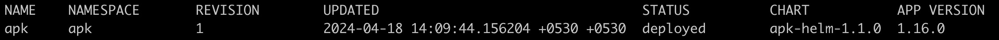
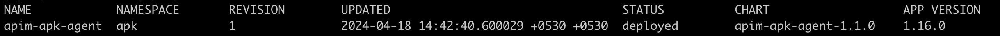

# Uninstall APK Components

**NOTE**: Uninstalling APK and any other components from the cluster involves deleting APK related data, configurations and CRDs from the cluster. Ensure that you back up any important data or configurations before proceeding with the rest of this guide.

## Uninstall APK

### Check Status of Current Installation

To view details about your existing APK installation, use the following command.

```
helm list -A
```

This will give you an output similar to the following.
[](../assets/img/setup/apk-helm-list-output.png)

This will give you information regarding your existing APK helm installation. 
For this guide, `chart-name` is the `NAME` of the installation, and the `namespace` is the `NAMESPACE` of the installation
The version of your installation is the 3 digit suffix in the `CHART` field.

For example, in the above image, the values are as follows.

- chart-name: apk
- namespace: apk
- version: 1.2.0-rc2

### Instructions for Uninstalling APK

To completely remove APK from your Kubernetes cluster, follow the steps given below.

1. Apply the following command.

=== "Command"
     ```
     helm uninstall apk -n apk
     ```
=== "Format"
     ```
     helm uninstall <chart-name> -n <namespace>
     ```

2. You will have the APK related CRDs remaining in the cluster. You can pipe them to a yaml file using the command given below.

=== "Command"
     ```
     helm show crds wso2apk/apk-helm --version 1.2.0-rc2 > crds.yaml
     ```
=== "Format"
     ```
     helm show crds <chart-name> <repository-name>/apk-helm --version <version> > crds.yaml
     ```

3. Then delete the CRDs using the following command.

```
kubectl delete -f crds.yaml
```

This will clear the APK installation from your Kubernetes cluster.

## Uninstall APIM APK Agent

### Check Status of Current Installation

To view details about your APIM APK Agent installation, use the following command.

```
helm list -A
```

This will give you an output similar to the following.
[](../assets/img/setup/apim-apk-agent-helm-list-output.png)

This will give you information regarding your Agent helm installation. 
For this guide, `chart-name` is the `NAME` of the installation, and the `namespace` is the `NAMESPACE` of the installation
The version of your installation is the 3 digit suffix in the `CHART` field.

For example, in the above image, the values are as follows.

- chart-name: apim-apk-agent
- namespace: apk
- version: 1.2.0-rc2

### Instructions for Uninstalling APIM APK Agent

To remove the APIM APK Agent from your Kubernetes cluster, apply the following command.

=== "Command"
     ```
     helm uninstall apim-apk-agent -n apk
     ```
=== "Format"
     ```
     helm uninstall <chart-name> -n <namespace>
     ```
