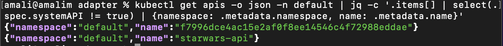

To undeploy an API, you can use the following steps.

### Step 1. Get the API CR Name

Execute the following command to list APIs deployed in your dataplane.

=== "Command Format"
    ```bash
    kubectl get apis -o json -n <namespace> | jq -c '.items[] | select(.spec.systemAPI != true) | {namespace: .metadata.namespace, name: .metadata.name}'
    ```
=== "Sample Output"
    [](../assets/img/api-management/select-api.png)

### Step 2. Delete the API CR

Copy the API CR name that you want to undeploy and execute the following command.

=== "Command Format"
    ```bash
    kubectl delete api <api-name> -n <namespace>
    ```

After deleting the API CR, the API will be undeployed from the dataplane.